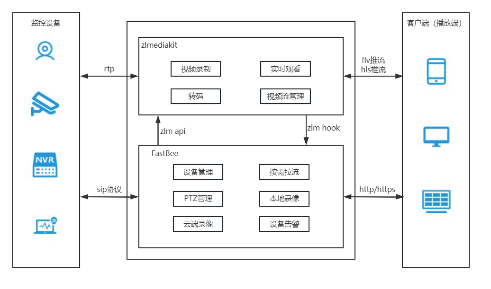
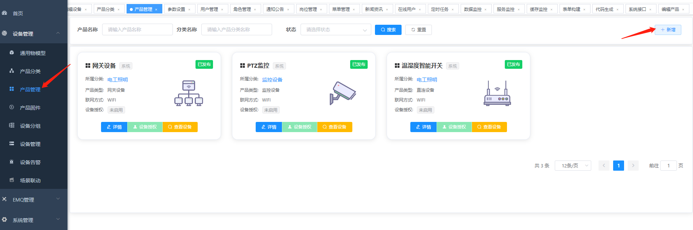
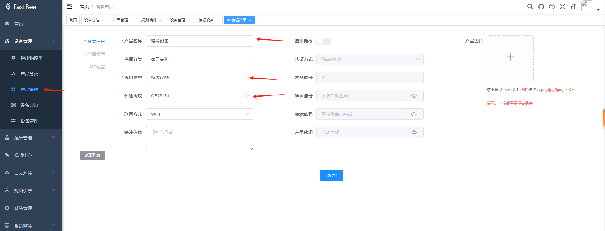
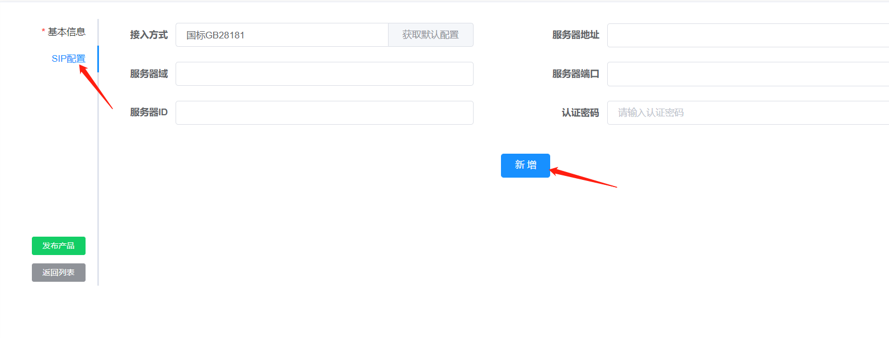
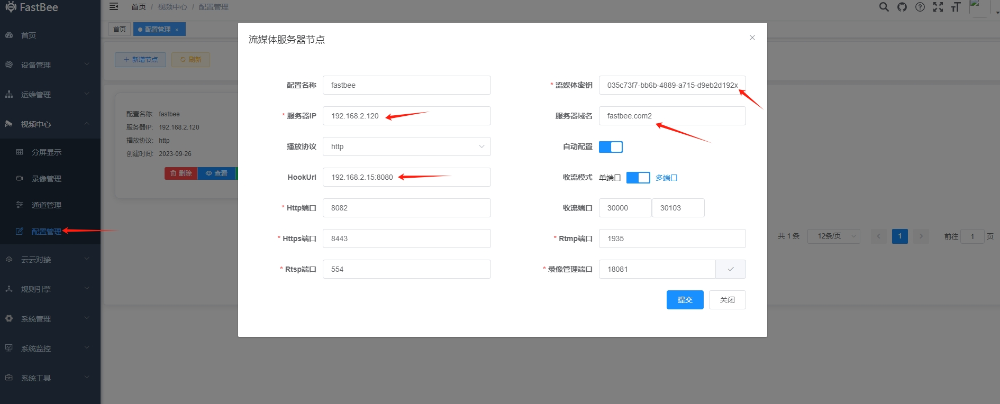
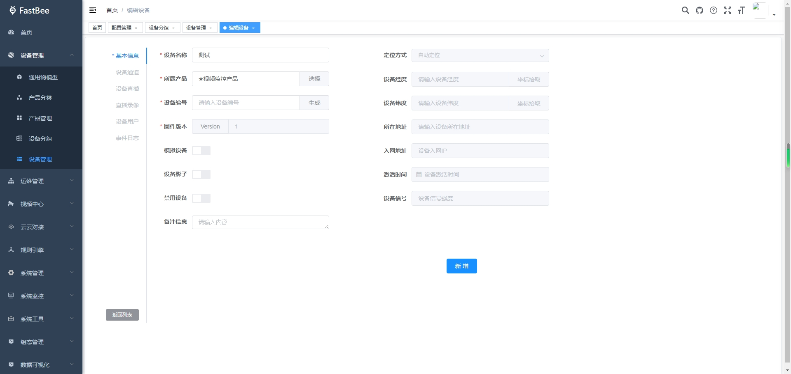
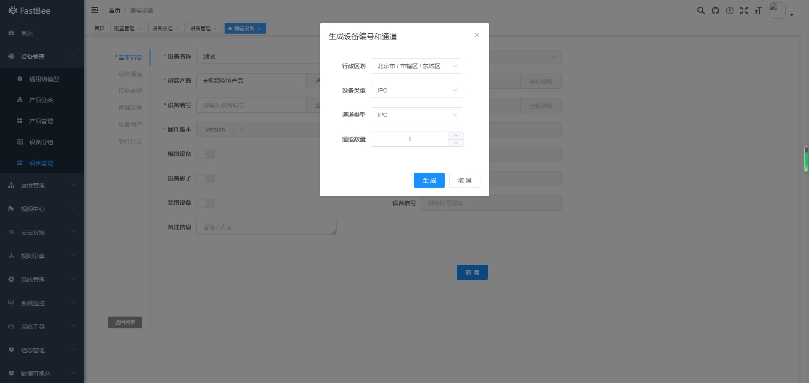
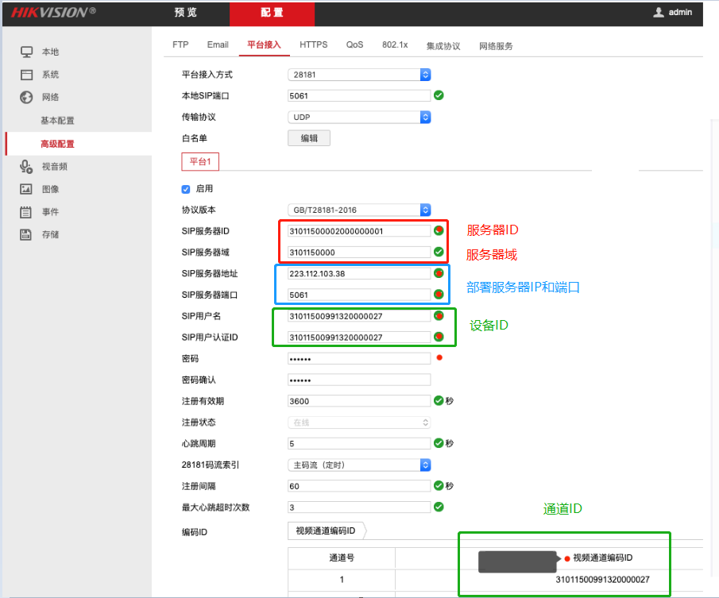
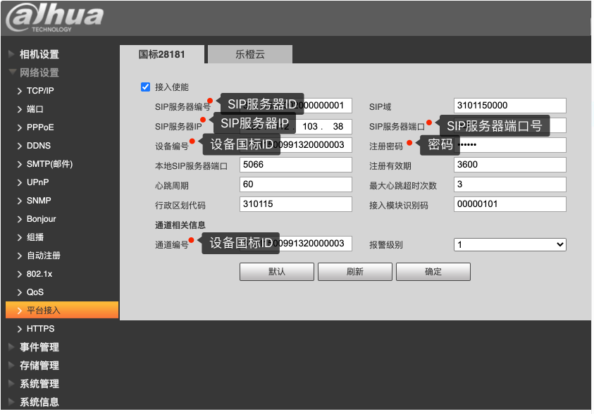
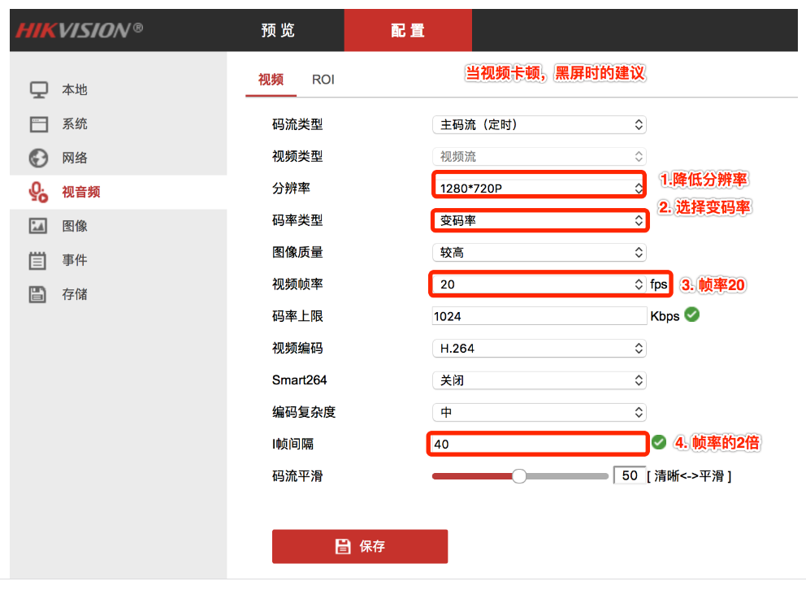

##### 一、监控平台整体架构


##### 二、目前平台支持的功能
- 设备接入注册
- 设备心跳
- 设备信息查询
- 设备通道查询
- 设备直播
- 云台控制
- 设备管理统一到物美平台
- 设备本地录像在线播放
- 设备通道国标ID生成
- 设备告警
- 服务端录像
- 监控截图
- 分屏显示

##### 三、部署环境
> 注意！！！部署环境用默认配置，ip和端口非必要别修改

##### 四、服务器开放端口：

- 5061:5061 //sip tcp端口号
- 5061:5061/udp //sip udp端口号
- 8082          //流媒体服务器api http接口
- 8443          //流媒体服务器api https接口
- 554:554       //rtsp推流接口
- 1935:1935     //rtmp推流接口
- 8000:8000     //rtc接口
- 30000-30500:30000-30500       //rtp tcp推流端口
- 30000-30500:30000-30500/udp   //rtp udp推流端口

> 注意！！！务必到服务器安全组开放对应端口，否则设备上线，点播和直播等功能无法使用。
##### 五、Docker部署 
- [zlmediakit镜像地址](https://hub.docker.com/layers/zlmediakit/zlmediakit/master/images/sha256-7ee971b6724ab6344d983d94453006196d2c5242ce3bcae178e87902508a4fef?context=explore)
- docker/data 下有docker-compose.yml文件，可以一键跑环境，免去修改配置的麻烦
- 参考文档：[Docker部署](https://fastbee.cn/doc/pages/docker/#%E4%B8%80%E3%80%81%E5%AE%89%E8%A3%85docker)

##### 六、非Docker部署，服务拆分部署
- 保证服务器对应服务的端口开放
- java sip配置根据本地接口环境，添加对应网卡接口ip
- zlmediakit conf/config.ini的hook api  添加java api回调地址
- 设备管理-> 视频配置-> 修改 zlmediakit 服务器IP 服务器域名 流媒体密钥等信息


##### 七、fastbee sip配置
- 配置文件在fastbee-admin/src/main/resources/application.yml
``` yml
# sip 配置 默认情况下是关闭sip服务的，需要时开启该服务
sip:
  enabled: true
## 注意！！！默认为容器IP，IDE启动可以写本地网卡内网IP
## 注意！！！本地调试需保持设备与服务器在同一局域网
  ip: 177.7.0.13
  port: 5061
  domain: 3402000000
  id: 34020000002000000001
  password: 12345678
```

##### 八、ZLMedia流媒体服务器配置
docker运行目录下 
- zlmedia/conf/config.ini   流媒体服务配置文件
- zlmedia/data/www/rtp/     摄像头拉流文件
- zlmedia/data/www/record/  摄像头录像文件
- zlmedia/data/www/snap/    摄像头截图路径
- zlmedia/data/logs/        日志文件

##### 九、设备接入流程
###### 1.新增监控产品
- 新增产品



- 选择设备类型



###### 2.新建SIP配置
- 点击获取默认配置，然后新建SIP配置



> 注意！！！sip配置不支持修改，会同步java中application-prod.yml中的配置。

###### 3.新建流媒体服务器配置
- 服务器IP：修改流媒体服务器IP为部署服务器公网IP，默认为http播放协议，
- 服务器秘钥：http api鉴权秘钥，需与zlmedia/conf/config.ini中api->secret和hook->admin_params保持一致
- 服务器域名：用https播放协议，需修改zlmedia/conf/default.pem证书，同时修改服务器域名
- HOOK URL：修改HOOK URL为java服务api接口，默认为：java:8080,可根据自己的部署情况修改



###### 4.新建设备，生成设备ID和通道ID
- 摄像头：设备类型为"IPC"，通道类型为"IPC"
- 录像机：设备类型为"录像机"，通道类型为"录像机"
- NVR+IPC：设备类型为"NVR"，通道类型为"IPC"
- DVR+IPC：设备类型为"DVR"，通道类型为"IPC"




###### 5.将相关信息填入设备
将产品中SIP配置和生成的id填入设备
- 服务器ID = SIP服务器ID（海康） = SIP服务器编号（大华）
- 服务器域 = SIP服务器域（海康） = SIP域（大华）
- 部署服务器公网IP = SIP服务器地址（海康） = SIP服务器IP（大华） 
- 服务器端口 = SIP服务器端口（海康） = SIP服务器端口（大华）
- 认证密码 = 密码（海康） = 注册密码（大华）
- 设备ID = SIP用户名（海康） = SIP用户认证ID（海康） = 设备编号（大华） 
- 通道ID = 视频通道编号ID（海康） = 通道编号（大华）

##### 十、海康接入示例：  配置路径：配置-> 网络-> 高级配置-> 平台接入



##### 十一、大华接入示例：  配置路径：配置-> 网络配置-> 平台接入



##### 摄像头流媒体格式建议为：视频：h264  音频：aac



