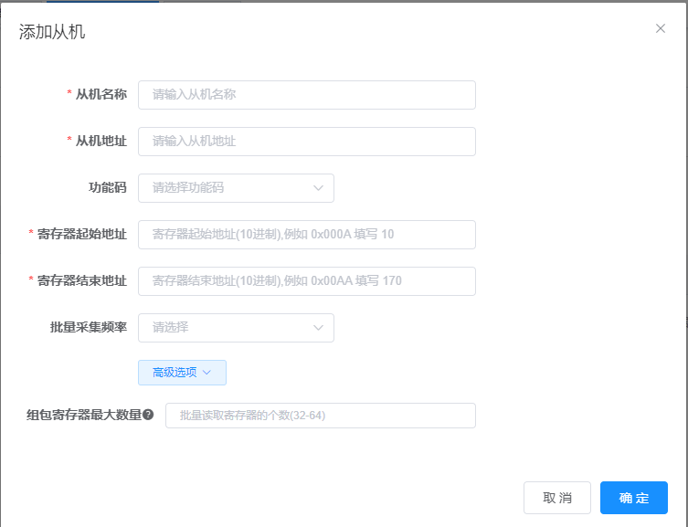
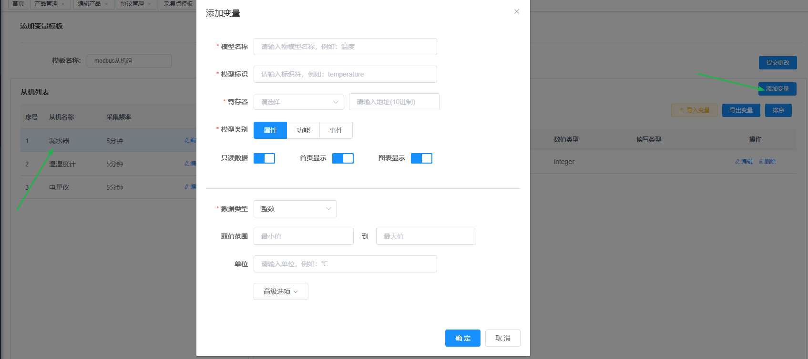
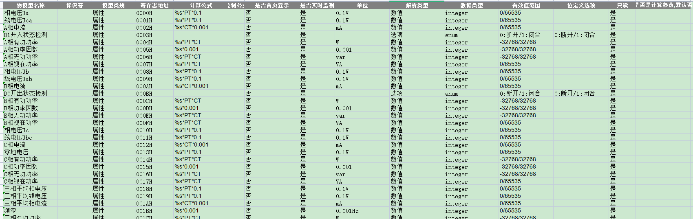
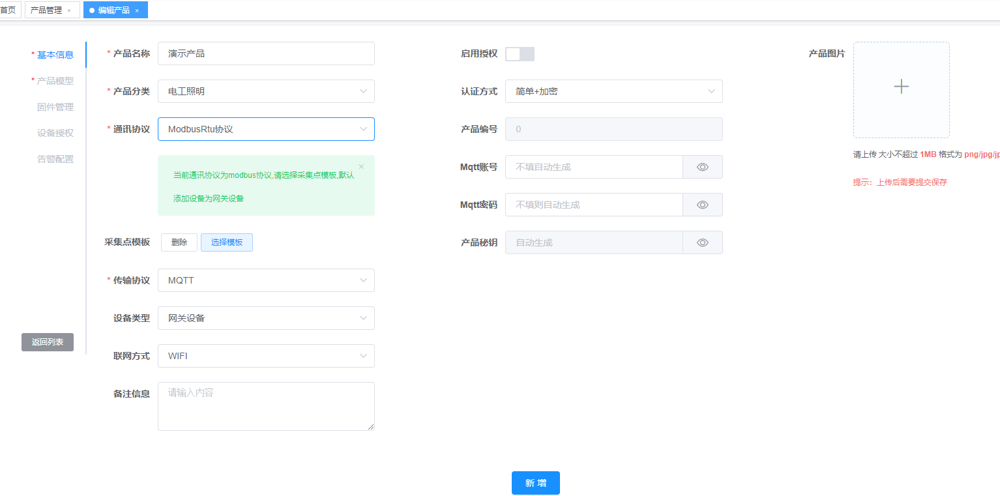
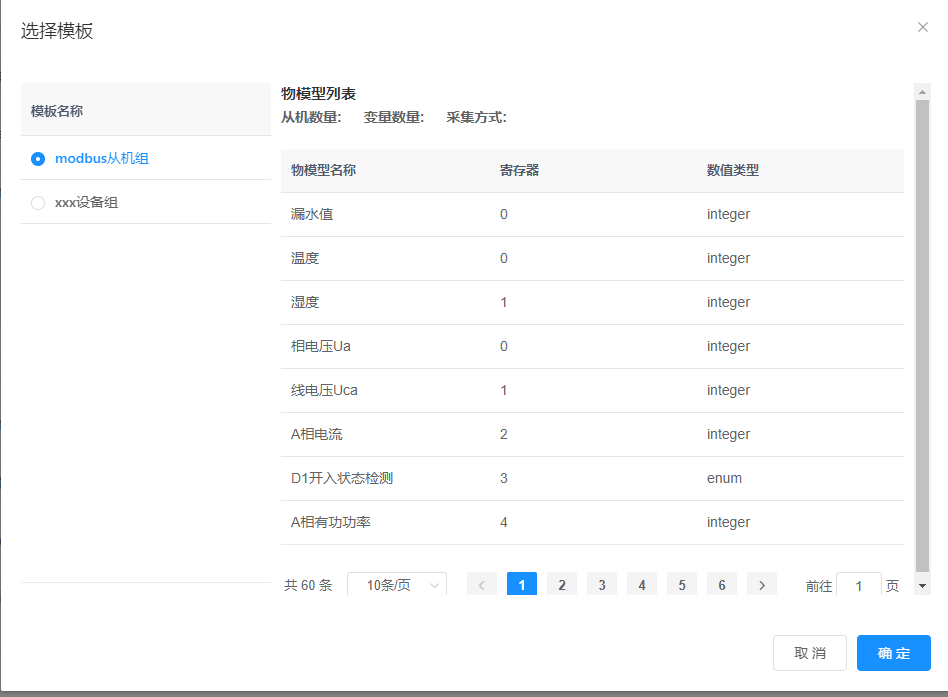
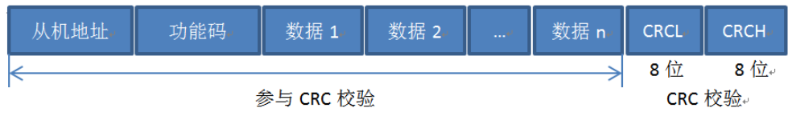
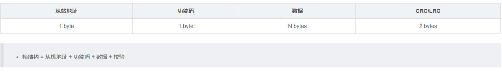
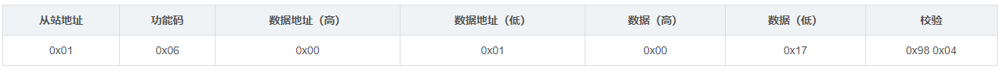
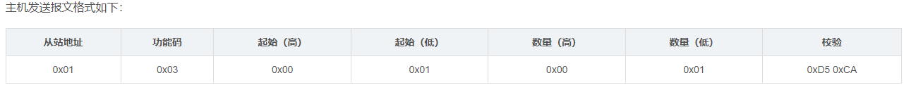

##### 一、新增Modbus设备

::: tip
本平台实现modbus协议的方式有两种方案，按照需要选择
:::

###### 1. 设备通讯协议

添加产品之前先确认是否有对应的设备通讯协议，由于硬件设备的通讯协议五花八门，目前系统支持json报文，modbusRtu协议报文，如需添加适配自己硬件设备的通讯解析，可以查看**基于注解方式添加通讯协议文档**

###### 2. 采集点模板配置

采集点模块即是物模型模板，由于之前的物模型模板不支持子设备，所以新增了采集点模块进行配置设备组的物模型

**Modbus实现云有两种方式**
::: tip
[两种实现方式的详细介绍>>>](/pages/modbus_case/)
:::

**a. 云端轮询**：云端结合采集点模板定时下发读指令给设备，由于是云端定时执行，无法做到实时性，当设备量少时，上千级的设备量以下，使用没有压力。当设备量超过万级时，云端压力较大，实时性很差，不推荐

**b. 边缘网关**：轮询交给边缘网关处理，外加MCU作为轮询载体，成本低，而且移植性强，大大提高云端处理数据的能力，而且能做到实时性，推荐使用。需要配合Dtu或者模组固件进行采集

采集点详情配置如下: 点击新增->添加变量模板，

###### 3. 添加模板如下：

###### 4. 添加从机：

从机地址 ： 硬件设备的地址编码，例如485接口，有1-3个子设备，设备地址可以为 01 02 03

功能码：目前支持 03,04

* 寄存器起始地址（10进制）： 一般为0x00，例如设备有0\~100个寄存器，起始地址就为 0
* 寄存器结束地址（10进制）: 例如设备有0\~100个寄存器，起始地址就为 100
* 批量采集频率：目前这个参数没有作用，采集频率在： 系统监控-定时任务-modbus云端轮询的定时任务调节
* 组包寄存器最大数量 : 该参数决定批量读取寄存器的个数，默认为32，若寄存器小于32，会根据起始地址和结束地址进行计算长度

###### 5. 为从机添加变量

* 单个变量添加流程： 选中从机，点击添加变量，如下，
* 模型名称：该物模型显示的名称
* 模型标识：如果是modbus，模型标识根据寄存器地址一样，自动填充
* 寄存器: 目前功能码支持 03 04，暂不支持01。后面输入框为寄存器地址值(10进制)

批量导入变量：点击导入变量，下载模板填写：如下

###### 6. 新建产品

在前面步骤新建了设备通讯协议和采集点模板后，新增一个产品，如下

选择通讯协议：系统目前只支持三种

选择采集点模块,我这里选择先配置好的采集模块，modbus从机组，

传输协议：目前支持 系统完全支持MQTT，TCP，其他协议服务如UDP，已经搭建，但是没有做协议解析逻辑。

设备类型： 这里选择了modbus-rtu协议后，自动选择网关设备

###### 7. 产品物模型:

新增后,可以看到配置的产品物模型:

###### 8. 新建设备

选择对应的产品，设备编号需要填写模组的IMEI号或者Dtu设备的MAC编号

###### 9. 运行状态和服务下发

新增完成后，可以看到设备的运行状态页签，设备最新的一次数据缓存

 

##### 二、Modbus协议

###### 1. Modbus-RTU协议

个报文就是一帧数据，一个数据帧就一个报文： 指的是一串完整的指令数据，本质就是一串数据。

- 从机地址: 每个从机都有唯一地址，占用一个字节,范围0-255,其中有效范围是1-247,其中255是广播地址(广播就是对所有从机发送应答)
- 功能码: 占用一个字节,功能码的意义就是,知道这个指令是干啥的,比如你可以查询从机的数据,也可以修改从机的数据,所以不同功能码对应不同功能.
- 数据: 根据功能码不同,有不同功能，比方说功能码是查询从机的数据，这里就是查询数据的地址和查询字节数等。
- 校验: 在数据传输过程中可能数据会发生错误，CRC检验检测接收的数据是否正确

###### 2. Modbus功能码

Modbus规定了多个功能，那么为了方便的使用这些功能，我们给每个功能都设定一个功能码，也就是指代码。如下：

| 标题 | 标签 | 字段名 |
|----|----|-----|
| [01H](https://www.wolai.com/rk8XB9vTLYriFGx1FhBXZ8 "01H") | 读取输出线圈 |  |
| [02H](https://www.wolai.com/wCqzbesbXeBHtoJLZ96yVg "02H") | 读取输入线圈 |  |
| [03H](https://www.wolai.com/mn5ztVnp67Er1ZuiSKZ2xF "03H") | 读取保持寄存器 |  |
| [04H](https://www.wolai.com/rwh2vcYkj4vBTfQrBtYfHZ "04H") | 读取输入寄存器 |  |
| [05H](https://www.wolai.com/48E1znXyqc9oxWtt2j8rtn "05H") | 写入单线圈 |  |
| [06H](https://www.wolai.com/idWnqLH9FFPSN16VBBnxox "06H") | 写入单寄存器 |  |
| [0FH](https://www.wolai.com/jZALeJWbXymKqHdSsxgPRi "0FH") | 写入多线圈 |  |
| [10H](https://www.wolai.com/3modMCUnbEgNLwopJmVpZ8 "10H") | 写入多寄存器 |  |
| [\_](https://www.wolai.com/kjN2V2QB6LT94ThyudwXAy "_") |  |  |

###### 3. 主机对从机读数据操作

* 0x01：从机的地址 0x03：查询功能，读取从机寄存器的数据 0x00 0x01： 代表读取的起始寄存器地址.说明从0x0001开始读取. 0x00 0x01： 查询的寄存器数量为0x0001个 Modbus把数据存放在寄存器中,通过查询寄存器来得到不同变量的值,一个寄存器地址对应2字节数据; 寄存器地址对应着从机实际的存储地址 0xD5 0xCA： 循环冗余校验 CRC

* 从机回复报文格式如下： | 从站地址 | 功能码 | 字节计数 | 字节1 |字节2 | 校验 | | 0x01 | 0x03| 0x02| 0x01 | 0x00| 0x17| 0xF8 0x4A |

* 0x01：从机的地址 0x03：查询功能，读取从机寄存器的数据 0x02： 返回字节数为2个 一个寄存器2个字节 0x00 0x17：寄存器的值是0017 0xF8 0x4A： 循环冗余校验 CRC

###### 4. 主机对从机写数据操作

* x01：从机的地址 0x06：修改功能，修改从机寄存器的数据 0x00 0x01： 代表修改的起始寄存器地址.说明修改0x0000-0x0001的存储内容 0x00 0x17： 要修改的数据值为0017 0x98 0x04： 循环冗余校验 CRC

* 从机回复报文一样

**0106000100179804**
| 0x01 | 06 | 00 01 | 00 17 | 98 04 |
|------|----|-------|-------|-------|
| 从机地址 | 功能号 | 数据地址 | 数据 | CRC校验 |

###### 5.主机对从机读数据操作

**0103020017F84A**
| 0x01 | 03 | 00 01 | 00 01 | D5 CA |
|------|----|-------|-------|-------|
| 从机地址 | 功能号 | 数据地址 | 读取数据个数 | CRC校验 |

* 0x01 06 00 01 00 17 98 04 从机地址 功能号 数据地址 数据 CRC校验

* 0x01 06 00 01 00 17 98 04 从机地址 功能号 数据地址 数据 CRC校验

* 0x01 06 00 01 00 17 98 04 从机地址 功能号 数据地址 数据 CRC校验

* 0x01 06 00 01 00 17 98 04 从机地址 功能号 数据地址 数据 CRC校验

###### 6. 报文实例

读40005、40006两个寄存器，假设从机地址为1

下行报文：**01 03 00 04 00 02 85 ca**
|  |  |  |  |  |
|--|--|--|--|--|
| 从机地址 | 功能码 | 寄存器起始地址 | 读取寄存器个数 | CRC校验 |
| 01 | 03 | 00 04 | 00 02 | 85 ca |

上行报文：**01 03 04 00 00 00 00 21 33**
|  |  |  |  |  |  |
|--|--|--|--|--|--|
| 从机地址 | 功能码 | 返回字节个数 | 寄存器40005数据 | 寄存器40006数据 | CRC校验 |
| 01 | 03 | 04 | 00 00 | 00 00 | 21 33 |

###### 7. Modbus-Rtu常用功能码
|  |  |  |  |
|--|--|--|--|
| 数据类型 | 读功能码 | 写功能码 | 对象类型 |
| 离散量输入 | 02 |  | 单个位 |
| 线圈状态 | 01 | 05,15 | 单个位 |
| 输入寄存器 | 04 |  | 16位字 |
| 保持寄存器 | 03 | 06,16 | 16位字 |

###### 8. 寄存器起始地址（起始数据地址）
|  |  |
|--|--|
| 数据类型 | 参数地址,寄存器编号 |
| 离散量输入 | 00001\~0FFFF |
| 线圈状态 | 10001\~1FFFF |
| 输入寄存器 | 30001\~3FFFF |
| 保持寄存器 | 40001\~4FFFF |

