##### 一、开启TCP服务

TCP开启在application.yml文件中控制。

::: tip
tcp.enabled:  开启后， TCP服务器启动连接设备
:::

**openws**： 开启后，配合TCP服务，推送设备消息至前端实时更新

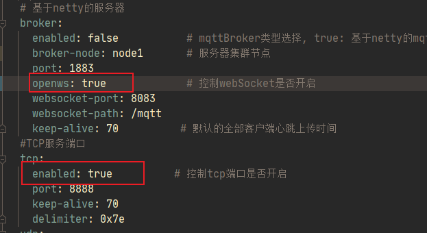
  

##### 二、TCP设备连接


###### 1. 注册包：

由于TCP设备连接，需要识别设备，因此TCP客户端连接时，**上报的第一个报文**为客户端的注册包。

例如：`7e80D4AD203F3A1C7e`

```
其中 7e 是包头包尾

80是注册包的标识位

D4AD203F3A1C 是设备编号

```
客户端上报注册包后，更新设备状态为在线

###### 2. 心跳包:

TCP需要主动发送消息来维持设备的心跳保持，上图中 keep-alive 是心跳超时的判定时间 70s，因此设备的心跳需要维持在70s以下。

心跳包例如: `7e817e`   7e 是包头包尾，81是标识位  (**心跳包只是维持TCP长连接，一般无其他实际意义**)

###### 3. 特殊的注册，心跳 数据包：
在有些设备客户端，会把设备的注册包，心跳包，数据包，定时上报，一方面是包含了设备编号，也可以维持了心跳，数据包还包含了设备上报的信息，这种情况系统也是可以支持的。


##### 三、TCP模拟客户端测试

模拟客户端放在如下文件


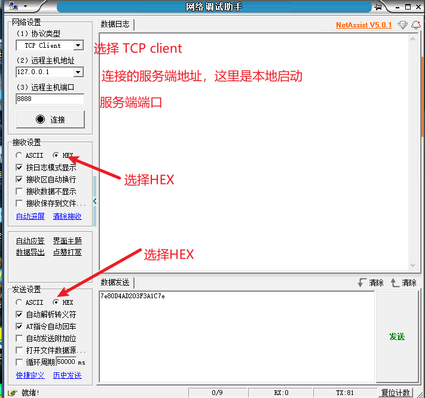

###### 1. 模拟客户端上线
发送注册包：配置好后，点击链接，发送注册包，如下
7e80D4AD203F3A1C7e
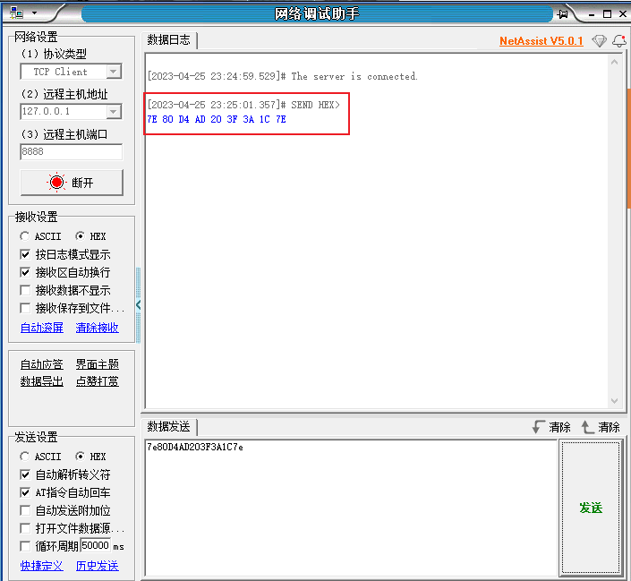

这个时候，看下本地启动服务可以看到
* a. TCP客户端上线
* b. 更新TCP客户的状态
* c. 记录设备事件记录

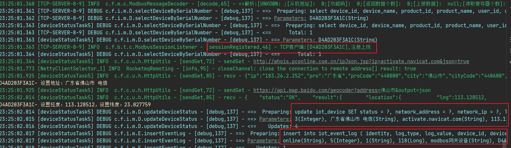
查看前端页面展示：
webSocket 推送设备上线消息，实时更新前端显示
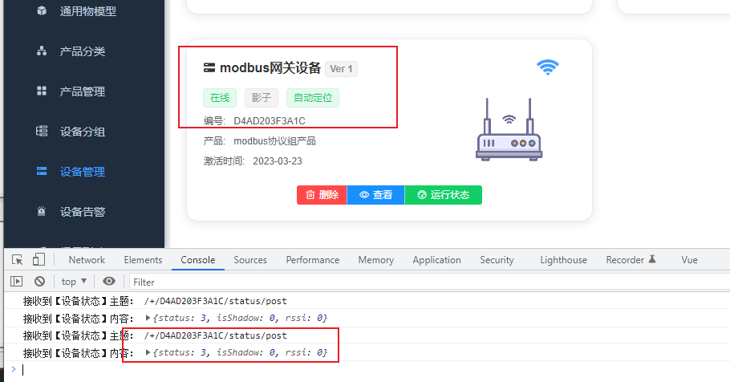

###### 2. 模拟TCP客户端断电或 断开

   **断电需要等待设备心跳超时(70S), 断开连接是，是实时上报设备状态**

断开连接是，打印信息如下，更新设备上下线状态，新增设备事件记录，前端ws推送实时更新

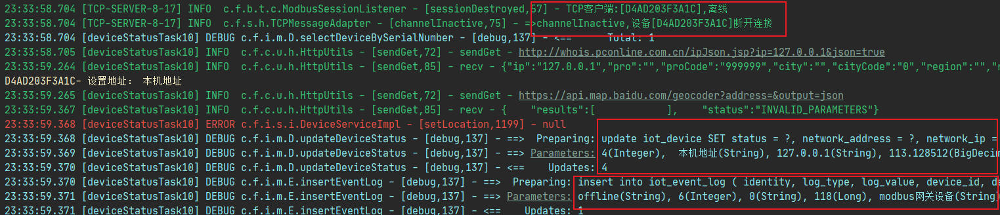
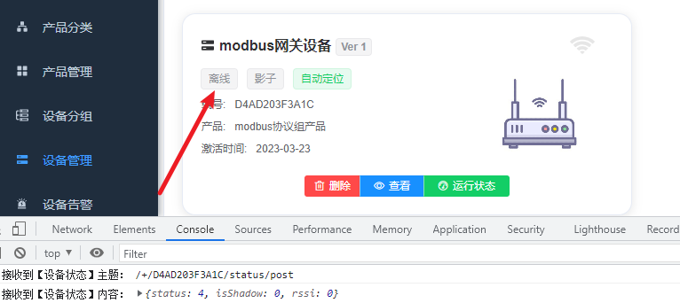

同样模拟客户端断电，需要等待客户端超过心跳超时时间 (70s)，更新动作跟设备断开一致。

##### 四、TCP客户端前端连接展示
新建产品，选择TCP传输协议，通讯协议可以选择 JSON，Modbus-rtu协议
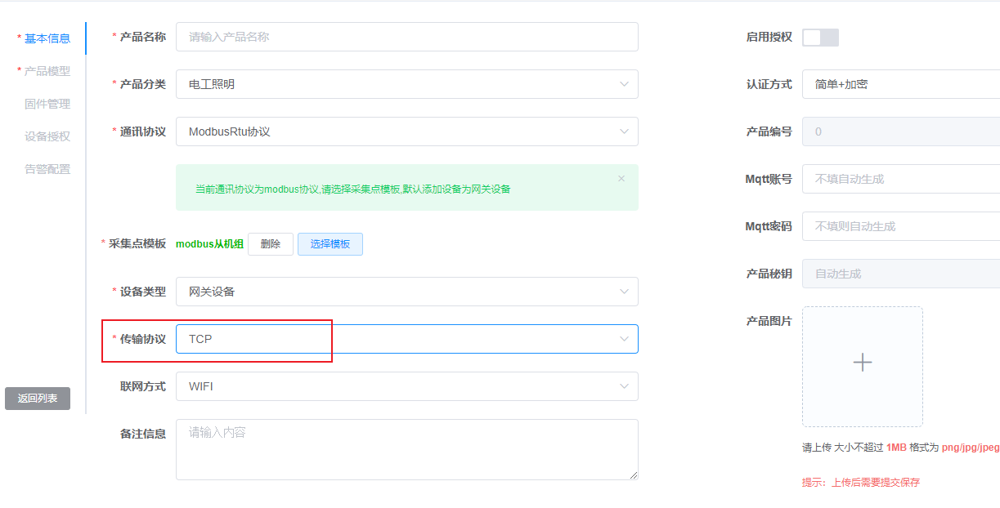

新建产品后，选中产品新建设备即可。

##### 五、TCP + MODBUS

云端轮询，用模拟设备可以看到下发到设备的读指令，如下:

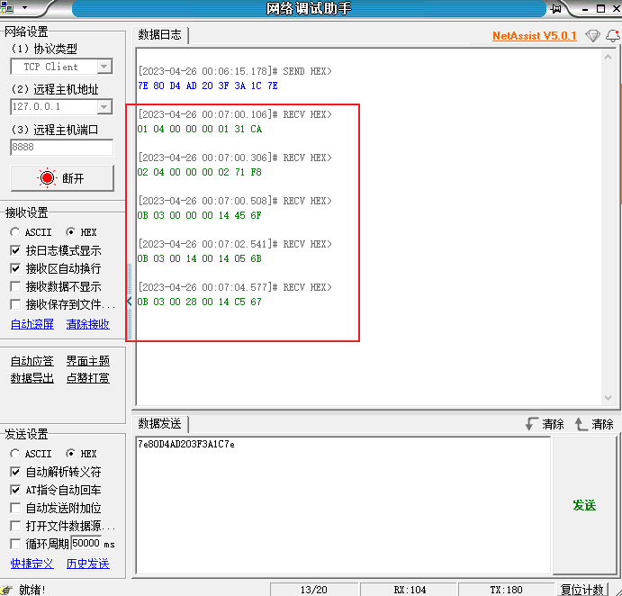

目前采用云端modbus轮询，采集数据，具体步骤，可以参考MQTT+MODBUS轮询方案

##### 六、TCP+JSON

 这里采用`动态倾角监测仪(通讯协议)2023-3-1 103136` 设备通讯协议进行演示。(应答机制)

 ::: details
**A. 设备监测数据报文**
* 报文说明

动态倾角仪处于低功耗的时候、按照平台设定的采集间隔和发送间隔通讯、监测站每一个通讯间隔向平台发送一次监测数据，数据采用HTTP以POST方式发送、数据格式为标准的JSON键值对。如果平台在2倍间隔时没有收到监测数据、可判定为设备离线。
* 报文示例

```
{
      "dev_ty":4000,
      "pro_ty":"rf_epmt_qjdt_1105",
      "use_id":0,
      "dev_id":2302180001,
      "pcb_ver":221214,
      "bot_ver":2023021700,
      "app_ver":2023030100,
      "net_ty":1,
      "link_ty":0,
      "pak_ty":"up_data",
      "mk_id":"",
      "ka_id":"",
      "rssi":0,
      "snr":0,
      "x_jsd":0.0492592602968216,
      "y_jsd":0.0070370370522141457,
      "z_jsd":4.4122223854064941,
      "temp_c_val":14.195767402648926,
      "x_jd":0.63720703125,
      "y_jd":0.0933837890625,
      "z_jd":89.3463134765625,
      "cj_s":300,
      "up_s":3600,
      "xt_s":3600,
      "run_s":70,
      "in_v":0.00880800001323223,
      "bat_v":6.4534401893615723,
      "gn_wd":0,
      "gn_jd":0,
      "gn_hb":521,
      "mem_sx":19276,
      "tm_sm":"000101001046"
}
```
* JSON键值说明

|  键名  |  数据类型    |  说明         |  备注                 |
|:--------|:-----------|:--------------|:----------------------|
|dev_ty	|U16	      |设备类型	      |厂家研发编码、用户无需在意|
|pro_ty	|String	|产品类型	      |rf_epmt_qjdt_1105=动态倾角仪|
|use_id	|U16	      |用户ID	      |厂家对用户的编码|
|dev_id	|U32	      |设备唯一ID	      |设备厂家对设备的唯一编号|
|pcb_ver	|U32	      |电路板版本号	|设备电路板版本号|
|bot_ver	|U32	      |启动程序版本	|远程启动程序版本号|
|app_ver	|U32	      |功能程序版本	|功能程序版本号|
|net_ty	|U8	      |网络类型	      |1=CAT1、5=NBIOT、6=RJ45、8=北斗短报文|
|link_ty	|U8	      |连接类型	      |0=短连接=设备发送完数据等待5秒主动断开连接、1=长连接=设备发送完毕数据不断开连接。|
|pak_ty	|String	|数据包类型	      |"up_data"=上报监测数据|
|mk_id	|String	|无线模块号	      |模块号IMEI=15-20个字符串组成|
|ka_id	|String	|流量卡号	      |物联网卡号IMSI=15-20个字符串组成|
|rssi	      |S16	      |信号强度	      |现场网络信号的强度|
|snr	      |S16	      |信号质量	      |现场网络信号的质量|
|x_jsd	|float	|X轴加速度	      |重力加速度、单位g|
|y_jsd	|float	|Y轴加速度	      |重力加速度、单位g|
|z_jsd	|float	|Z轴加速度	      |重力加速度、单位g|
|temp_c_val |float	|温度	            |设备内部温度、单位℃|
|x_jd	      |float	|X轴角度	      |倾角度、单位°|
|y_jd	      |float	|Y轴角度	      |倾角度、单位°|
|z_jd	      |float	|Z轴角度	      |倾角度、单位°|
|cj_s	      |U32	      |采集数据间隔	|设备每cj_s秒采集并和阈值对比一次传感器数据|
|up_s	      |U32	      |上报数据间隔	|设备每到up_s秒向平台发送一次数据报文、平台收到以后尽快向设备回馈报文、超过2倍up_s时间没有收到平台回馈，设备会重启当前连接。|
|xt_s	      |U32	      |设备心跳数据	|预留键值对、暂时未使用|
|run_s	|U32	      |设备运行时间	|设备从上电到现在的工作时间、单位秒|
|in_v	      |float	|太阳能或输入电压	|太阳能或市电AC-DC适配器输入的电压|
|bat_v	|float	|蓄电池电压	      |蓄电池电压|
|gn_wd	|float	|定位纬度	      |GNSS当前定位-纬度|
|gn_jd	|float	|定位经度	      |GNSS当前定位-经度|
|gn_hb	|float	|定位海拔	      |GNSS当前定位-海拔高度|
|mem_sx	|U32	      |剩余内存	      |设备操作系统的剩余内存|
|err_cd	|U16	      |错误代码	      |当前设备的错误代码0=无错误、其它的参考后面的错误代码定义|
|tm_sm      |/	      |/	            |预留键值对、暂时未使用|

**B、平台回馈报文**
* 报文说明

平台收到倾角仪的监测数据以后、需尽快通过SET报文，向倾角仪发送参数设置信息。考虑信号不好的网络延迟和平台服务响应时间在内、如果在10秒内没有收到平台的ACK回馈，倾角仪在预定的重传次数内(固定为5次)、向平台重传数据保证通讯的可靠性。

* 报文示例
```
{
      "pak_ty":"set_inf",
      "cj_s":null,
      "up_s":3600,
      "xt_s":3600,
      "x_yz":500,
      "y_yz":500,
      "z_yz":500,
      "nian":2022,
      "yue":3,
      "ri":25,
      "shi":12,
      "fen":23,"miao":33
}

```

* JSON键值说明

|  键名  |  数据类型    |  说明         |  备注                 |
|:--------|:-----------|:--------------|:----------------------|
|pack_ty	|String	|数据包类型	      |"set_inf"=设置报文|
|cj_s	      |U32	      |数据采集间隔	|平台设置设备的数据采集间隔|
|up_s	      |U32	      |上报数据间隔	|平台设置设备的数据上报间隔|
|xt_s	      |U32	      |设备心跳间隔	|平台设置设置的心跳上报间隔、默认不使用|
|x_yz	      |Float	|X轴增量阈值	|设置X轴的增量阈值，1.2为±1.2的变动|
|y_yz	      |Float	|Y轴增量阈值	|设置Y轴的增量阈值，1.2为±1.2的变动|
|z_yz	      |Float	|X轴增量阈值	|设置Z轴的增量阈值，1.2为±1.2的变动|
|nian	      |U8	      |下发同步=年	|平台下发设备同步时间=年=2022=22|
|yue	      |U8	      |下发同步=月	|                          |
|ri	      |U8	      |下发同步=日	|                          |
|shi	      |U8	      |下发同步=时	|                          |
|fen	      |U8	      |下发同步=分	|                          |
|miao	      |U8	      |下发同步=秒	|                          |
|err_cd	|U16	      |错误代码	     |错误代码0=无错误、其它的参考后面的错误代码定义|


:::

   
**设备上报报文:** （设备数据，注册包，心跳包组合）

```
{
      "dev_ty":4000,
      "pro_ty":"rf_epmt_qjdt_1105",
      "use_id":0,
      "dev_id":2302180001,
      "pcb_ver":221214,
      "bot_ver":2023021700,
      "app_ver":2023030100,
      "net_ty":1,
      "link_ty":0,
      "pak_ty":"up_data",
      "mk_id":"",
      "ka_id":"",
      "rssi":0,
      "snr":0,
      "x_jsd":0.0492592602968216,
      "y_jsd":0.0070370370522141457,
      "z_jsd":4.4122223854064941,
      "temp_c_val":14.195767402648926,
      "x_jd":0.63720703125,
      "y_jd":0.0933837890625,
      "z_jd":89.3463134765625,
      "cj_s":300,
      "up_s":3600,
      "xt_s":3600,
      "run_s":70,
      "in_v":0.00880800001323223,
      "bat_v":6.4534401893615723,
      "gn_wd":0,
      "gn_jd":0,
      "gn_hb":521,
      "mem_sx":19276,
      "tm_sm":"000101001046"
}
```

**服务端收到设备上报消息，应答设备:**

```
{
      "pak_ty":"set_inf",
      "cj_s":null,
      "up_s":3600,
      "xt_s":3600,
      "x_yz":500,
      "y_yz":500,
      "z_yz":500,
      "nian":2022,
      "yue":3,
      "ri":25,
      "shi":12,
      "fen":23,
      "miao":33
}
```

   模拟TCP客户端示例：

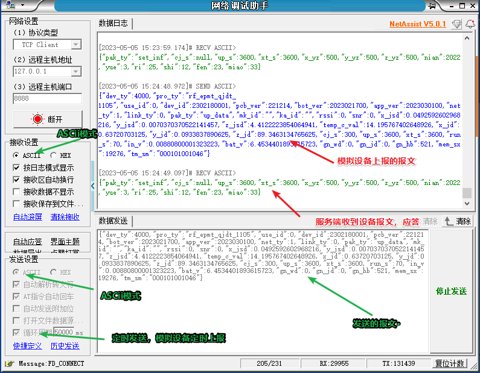

##### 七、TCP客户端指令下发

如下图所示:

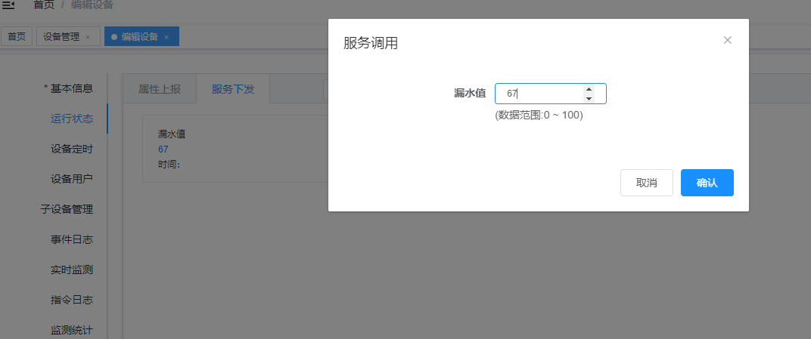

查看模拟模拟客户端可以看到，写指令下发成功，如下图所示：

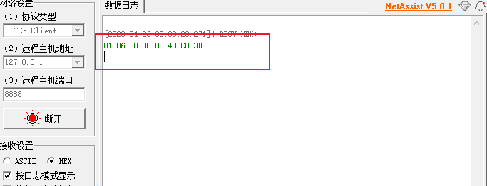

##### 八、TCP数据包，粘包，分包处理

###### TCP粘包拆包发生场景
* 因为TCP是面向流，没有边界，而操作系统在发送TCP数据时，会通过缓冲区来进行优化，例如缓冲区为1024个字节大小。
* 如果一次请求发送的数据量比较小，没达到缓冲区大小，TCP则会将多个请求合并为同一个请求进行发送，这就形成了粘包问题。
* 如果一次请求发送的数据量比较大，超过了缓冲区大小，TCP就会将其拆分为多次发送，这就是拆包。

###### 对于粘包和拆包问题，常见的解决方案有四种：
1. 发送端将每个包都封装成**固定的长度**，比如100字节大小。如果不足100字节可通过补0或空等进行填充到指定长度;
2. 发送端在每个包的末尾使用**固定的分隔符**，例如\\r\\n。如果发生拆包需等待多个包发送过来之后再找到其中的\\r\\n进行合并;例如，FTP协议;
3. 将消息分为头部和消息体，头部中保存整个消息的长度，只有读取到足够长度的消息之后才算是读到了一个完整的消息;
4. 通过**自定义协议进行粘包和拆包**的处理

###### Netty对粘包和拆包问题的处理
Netty对解决粘包和拆包的方案做了抽象，提供了一些解码器(Decoder)来解决粘包和拆包的问题。如：
* LineBasedFrameDecoder：以行为单位进行数据包的解码;
* DelimiterBasedFrameDecoder：以特殊的符号作为分隔来进行数据包的解码;
* FixedLengthFrameDecoder：以固定长度进行数据包的解码;
* LenghtFieldBasedFrameDecode：适用于消息头包含消息长度的协议(最常用);

###### FastBee的TCP服务端，解决粘包，分包问题
1. 固定分隔符

      <span dir="">DelimiterBasedFrameDecoder</span> 类定义了分割符处理粘包，分包问题
      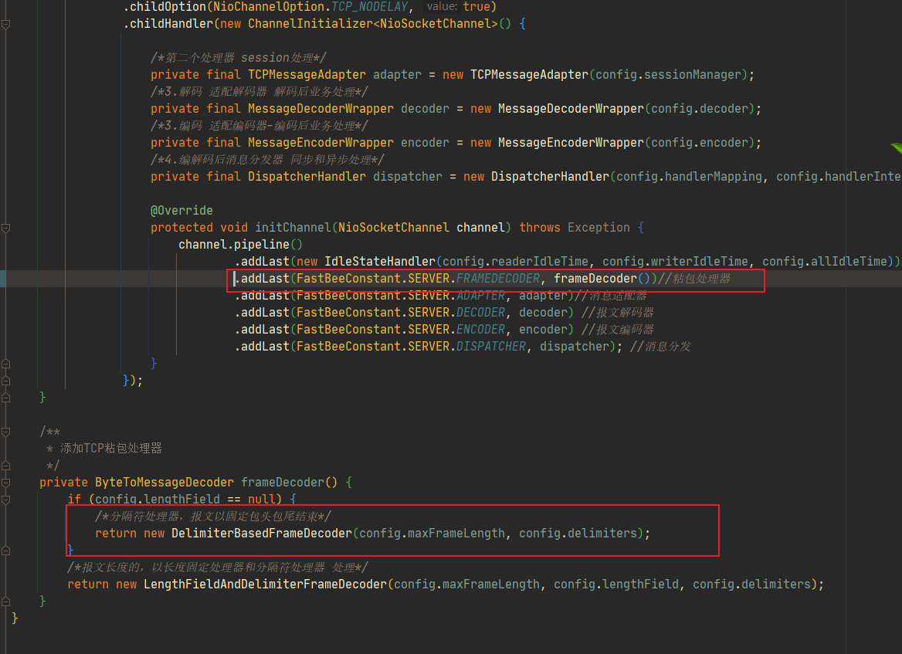
      
      TCP服务器启动处理客户端消息配置中，第二个处理类配置了粘包，分包处理在TCP启动时候，添加分隔符号
      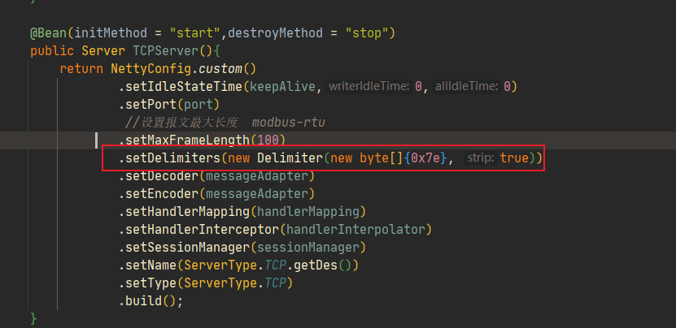

2. 固定长度

<span dir="">LengthFieldAndDelimiterFrameDecoder</span> ，固定长度配置在TCP启动时候，配置如下做固定长度处理粘包，分包问题
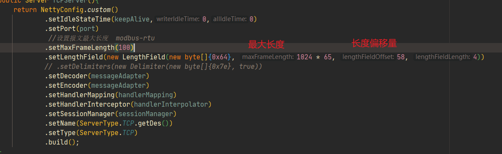

