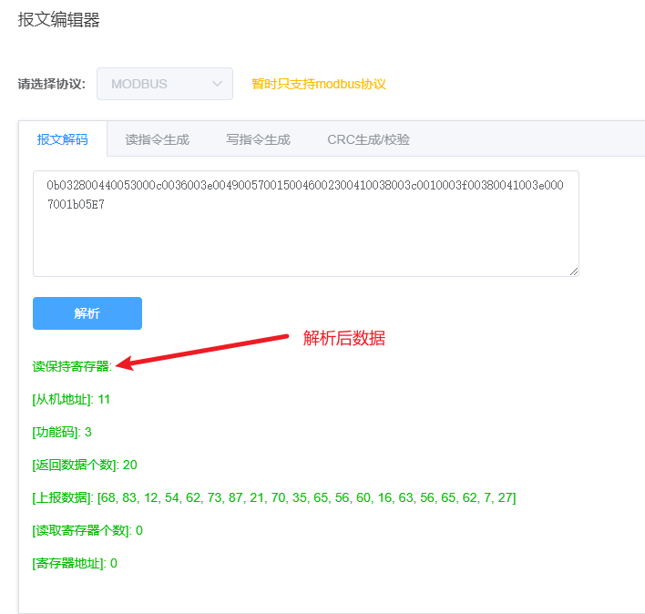

::: tip
* FastBee V2.0 版本新增了设备模拟功能，暂时只支持 modbus 设备
:::
当用户完成了，产品的创建，并新建了产品的采集点模板后，我们就可以在新增设备这块，添加模拟设备，方便用户调试

##### 一、新建设备，选择为模拟设备

##### 二、新建完成后，点击进入设备模拟模块

在页签 **运维管理 --> 设备模拟 ，**界面如下

  

##### 三、设备启动轮询

进入设备列表，选中设备，点击启动轮询按钮，设备自动加入设备轮询列表中，模拟 modbus 设备轮询上报。

##### 四、启动轮询后，设备模拟器推送，物模型的值更新。

为了模拟设备数据变化上报，每次读取的数据都是随机生成。启动轮询后，可以看到如下界面

1. `绿色`代表云端下发读指令，`蓝色`代表模式设备上报数据

2. 右侧的属性数据上报，会推送更新值。
    
    
##### 五、模拟设备写指令下发

输入值，点击发送。

自由调试模式，目前支持两个 topic：

1. 发布设备读取：下发设备读指令，获取设备寄存器的值
2. 发布设备写入： 下发设备写指令，更改设备寄存器的值

##### 六、配套的报文生成

1. **发布属性读取**，即下发读指令是，可以打开报文编辑器，如下：

2. **发布写指令**，即是下发写指令，更改设备寄存器的值

3. 额外功能

报文编辑器，除了生成读写指令外， 还可以**解析上报报文，校验 CRC 编码，和生成 CRC 编码**

* 解析上报报文

* CRC 验证

* CRC 生成

