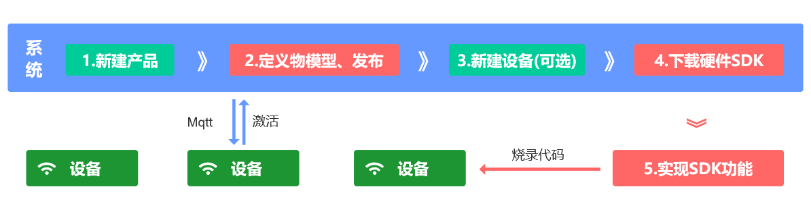

## 一、使用流程
1. 新建产品
2. 导入或新建产品物模型，然后发布产品
3. 新建设备(可跳过，直接在sdk中配置设备信息，设备认证成功后，系统自动生成对应设备实体)
4. 下载sdk，配置设备信息，完成具体功能，烧录代码到设备
5. 设备通电后连接系统，设备自动激活



## 二、设备激活
::: tip
 [设备认证和发布设备信息教程，参考设备接入部分](/pages/device/)
:::
设备有 <Badge text="未激活" type="warning" vertical="middle"/> 
<Badge text="在线" type="tip" vertical="middle"/>
<Badge text="离线" type="warning" vertical="middle"/> <Badge text="禁用" type="error" vertical="middle"/> 几种状态，有两种方式可以更改设备状态：
1. 设备认证，认证成功后状态变更为在线
2. 发布设备信息主题，主题消息内容中状态固定为3=在线

``` json
# 描述：1.设备上电后发布设备信息； 2.设备接收到设备信息指令后发布设备信息
# rssi             设备信号（信号极好[-55— 0]，信号好[-70— -55]，信号一般[-85— -70]，信号差[-100— -85]）
# status           设备状态，固定为3，表示在线
# firmwareVersion  固件版本
# userId           可选，用户的ID，可设置为admin用户ID为1，仅Wifi类设备需要上传用户ID，配网时再分配设备给用户。
# longitude        可选，经度，使用设备定位时需要上传
# latitude         可选，纬度，使用设备定位时需要上传
# summary          可选，摘要，设备的配置信息等，json格式，对象可自定义
{
     "rssi": -43,
     "firmwareVersion": 1.2,
     "status": 3,
     "userId": "1", 
     "longitude": 0,
     "latitude": 0,
     "summary": {}
}
```

## 三、设备配网 / 扫码添加设备
::: tip
有两种情况：第一种是系统不存在该设备，配网或扫码后会新建设备到用户账号下；第二种是系统已存在该设备，配网或扫码后是关联设备到用户账号下。
:::
1. 设备配网：通过配网可以把wifi信息配置到设备，以及新建设备到用户账号下。目前H5、微信小程序、安卓和IOS都支持单设备配网，多设备配网只有微信小程序支持。单设备配网时用户手动切换手机wifi为设备热点，然后进行配网。


2. 扫码添加设备：用户通过扫码新建设备到自己账号下。系统中的每个设备都有二维码，在设备详情摘要中查看。二维码固定为下面JSON格式：
``` js
# type固定值为1，代表扫码添加设备
# type、deviceNumber、productId 为必填项，productName为可选项
{
	"type": 1,
	"deviceNumber": "D888666",
	"productId": 5,
	"productName": "智能插座"
}
```

## 四、数据同步
设备详情中的数据同步功能，主要用于解决后端掉线，重新上线，设备在此期间状态未同步到系统的问题。

## 五、多租户
系统默认包含五种类型账号：超级管理员，管理员、游客、租户、用户，通过角色区分。默认注册的账号为普通用户，可以重新给用户分配角色。
1. 超级管理员：admin账号，且只有一个。可以管理系统所有数据。
2. 管理员：可以管理系统所有数据，具体权限可自定义。
3. 游客：用于项目的演示，相对于管理员，缺少数据删除的权限和部分功能权限。
4. 租户：可以查询系统定义的产品分类和通用物模型，以及管理自己的产品、产品分类、通用物模型、产品固件、设备分组、场景联动和产品下的所有设备。
5. 用户：管理自己的分组、设备和场景联动，以及其他用户分享给自己的设备。

## 六、系统账号
``` shell
# 后台添加用户：默认密码为123456

管理员       admin     admin123
游客账号     fastbee     123456
租户T1       fastbee-t1  123456
用户U1       fastbee-u1  123456
```

## 七、数据监控账号
``` yml
# 文件位于 fastbee\springboot\fastbee-admin\src\main\resources\application-druid.yml
# 数据监控的账号密码配置，默认fastbee

statViewServlet:
    enabled: true
    # 设置白名单，不填则允许所有访问
    allow:
    url-pattern: /druid/*
    # 控制台管理用户名和密码
    login-username: fastbee
    login-password: fastbee
```

## 八、服务器配置推荐
推荐4核8G，100G硬盘以上服务器配置，这个配置一般阿里云、腾讯云等云服务器都有对应优惠活动。

## 九、名词解释
1. 物模型：物模型是产品或设备的数据模型。包括属性、功能和事件。属性指设备的状态、配置和监测数据，例如温湿度；监测数据只能读取，配置和状态可以读取和写入。功能用于执行某项特定任务，例如打开风扇，可读取和写入。事件是设备主动上报给系统，例如温度过高，设备异常等。


2. 设备影子：用于缓存设备的属性和功能。设备离线时可以控制设备，设备上线后系统把离线控制的属性和功能下发给设备，设备作出响应。


3. 场景联动：一种自动化业务逻辑的可视化编程方式。例如设置晚上回家这个场景，门锁一打开，就把电视、饮水机和空调打开。

## 十、Maven插件配置
``` yml
# 文件位于 fastbee\springboot\pom.xml
# 配置bootclasspath项，windows使用`;` ，linux使用 `:`

<plugins>
  <plugin>
      <groupId>org.apache.maven.plugins</groupId>
      <artifactId>maven-compiler-plugin</artifactId>
      <version>3.1</version>
      <configuration>
          <source>${java.version}</source>
          <target>${java.version}</target>
          <encoding>${project.build.sourceEncoding}</encoding>
          <compilerArguments>
              <!-- rt.jar和jce.jar中间的分隔符，windows为“;”，linux为“:” -->
              <bootclasspath>${java.home}/lib/rt.jar;${java.home}/lib/jce.jar</bootclasspath>
          </compilerArguments>
      </configuration>
  </plugin>
</plugins>
```

## 十一、日志文件配置
``` html
# 文件位于 fastbee\springboot\fastbee-admin\src\main\resources\lockback.xml

<!-- 日志存放路径 -->
<property name="log.path" value="/logs" />
<!-- 日志输出格式 -->
<property name="log.pattern" value="%d{HH:mm:ss.SSS} [%thread] %-5level %logger{20} - [%method,%line] - %msg%n" />
```

## 十二、文件上传路径配置
```
# 文件位于 fastbee\springboot\fastbee-admin\src\main\resources\application.yml
# 文件路径，以uploadPath结尾 示例（ Windows配置D:/uploadPath，Linux配置 /var/data/javva/uploadPath）

profile: /uploadPath
```


