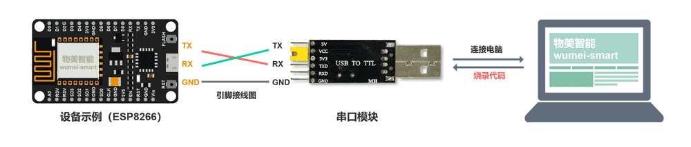

## 一、Arduino开发环境
* 开发工具： Arduino
* 开 发 板： esp8266 core for arduino v3.0.2 或 esp32 core for arduino 1.0.6
* 依 赖 库： PubSubClient2.8.0  、 ArduinoJson6.19.1 、 OneButton2.0.4

## 二、Arduino示例功能
* WIFI连接、MQTT连接、设备加密认证、设备配网、发布设备信息、订阅设备升级、Http和Mqtt获取设备当前时间、
* 物模型（属性、功能、事件）的发布和订阅
* 实时监测、模拟上报监测数据
* 用户自定义功能：继电器的开关

::: tip <a href="https://gitee.com/kerwincui/fastbee/tree/master/sdk/Arduino/FastBeeArduino" target="_blank" rel="nofollow">查看SDK源码</a>

:::

## 三、Arduino项目文件说明
使用该SDK主要修改Config.cpp里面的配置信息，在User.cpp里面根据产品物模型，实现自定义功能。

``` java
├───Apconfig.cpp     #设备配网
├───Apconfig.h
├───Auth.cpp         #设备认证
├───Auth.h
├───Base64.cpp       #base64编码和解码
├───Base64.h
├───Config.cpp       #全局配置信息
├───Config.h
├───Mqtt.cpp         #设备交互
├───Mqtt.h
├───User.cpp         #用户自定义功能
├───User.h 
├───FastBeeArduino.h   #程序入口
```

## 四、Ardunio烧录代码
设备烧录代码示例，常见串口模块如：CH340。ESP8266中GPIO0引脚跟GDN引脚连接，拉低电平，进入烧录模式。



## 五、其他硬件
##### 支持开发环境
- Arduino IDE
- VS code 
- luatIDE

##### 支持硬件开发框架
- Arduino
- ESP-IDF
- 合宙SDK

##### 支持的芯片方案
- ESP8266
- ESP32
- 合宙 air724


