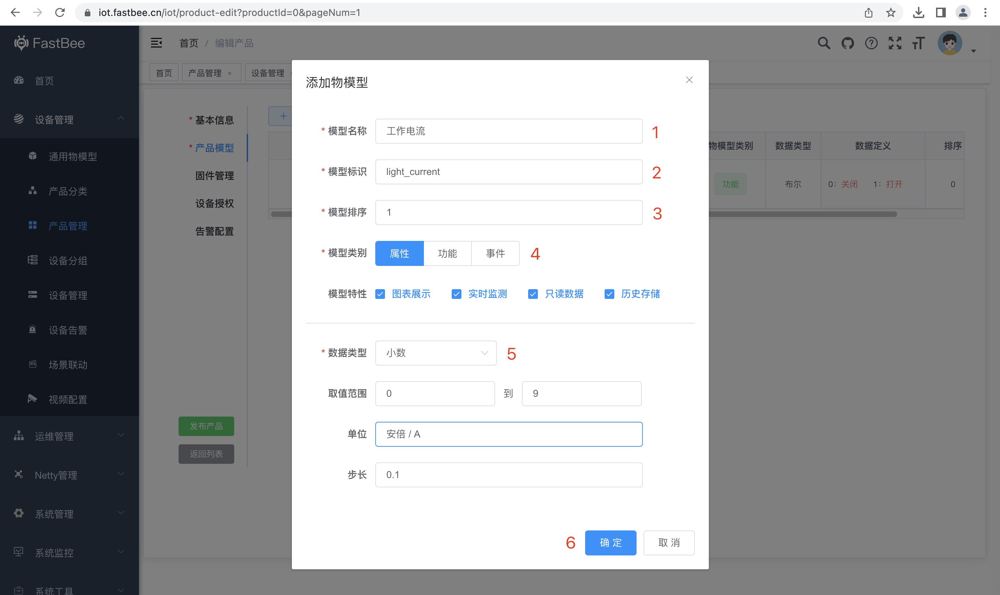
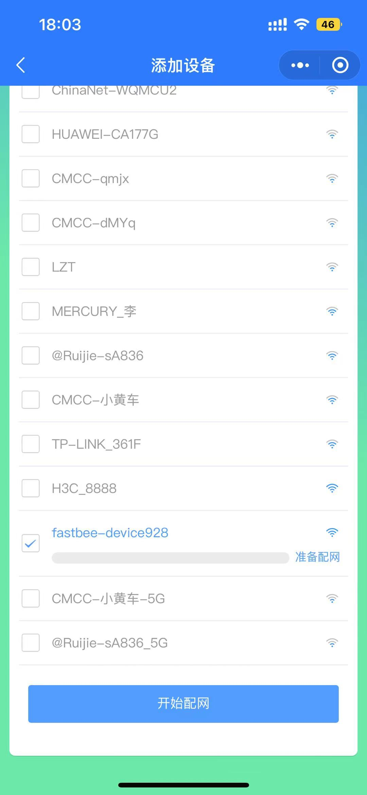

物联网平台提供设备上云、设备上报消息、云端订阅设备消息、云端下发指令到设备等服务，本文以路灯设备接入物联网平台为例，介绍设备如何接入物联网平台，及如何从物联网平台控制设备开关，帮助您快速了解物联网平台的基础能力。

## 一、创建产品分类

如果系统默认的产品类别无法满足产品标识，可增加新的类别。

1、在左侧导航栏，选择设备管理 > 产品分类，单击新增。

2、在新建产品分类页面，配置参数后，单击新增。

## 二、创建产品

要想使用物联网平台接入设备，在此之前，您需在物联网平台产品管理模块中创建产品。

1、在左侧导航栏，选择设备管理 > 产品管理，单击新增。

2、在新建产品页面，配置参数后，单击新增。

本文示例的产品名称为路灯，其他参数使用默认值，如下图所示。

## 三、定义物模型

平台支持为产品定义物模型，将实际产品抽象成由属性、功能、事件所组成的数据模型，便于物联网平台管理和数据交互。产品创建完成后，您可以为它定义物模型，产品下的设备将自动继承物模型内容。

::: warning
定义物模型前提 —— 已完成产品创建。具体操作，请参考创建产品与设备。
:::

1、在产品物模型页面，单击新增。

2、在模型定义页面，进行物模型配置，然后单击确认。

按照如下图设置路灯产品的开关功能和工作电流属性

- 开关功能

- 工作电流属性

3、确定无误之后，单击发布产品。

产品发布后，可以在产品管理页面搜索查看。

::: warning

1. 产品物模型的标识符必须唯一
2. 产品必须发布之后才能新建设备/接入设备。
3. 视频物模型正在开发中，暂时不支持视频回传业务定制。
   :::

## 四、接入设备

产品发布成功之后，便可接入设备。

本文模拟路灯设备进行开发，实现设备与物联网平台的通信，步骤如下：

1、在左侧导航栏，选择设备管理 > 设备管理，单击新增。

2、在新建设备页面，配置参数后，单击新增。

所属产品选择刚刚新建的产品（路灯）。

::: warning

1. 新建设备是可选步骤，批量添加设备时，可以先开发好固件，认证成功后，系统会自动新建一个对应设备实体，更适合批量设备的生产方式。
2. 自定义设备编号时，设备编号不能包含特殊符号；
3. 定位方式默认为自动定位，只能精确到城市；
4. 启用设备影子的时，当设备处于离线状态，系统仍然可以控制设备，只是设备不会做对应的处理，设备上线后立即作出响应。
   :::

## 五、固件开发

本文以 WeMOS D1 R1（8266WIFI 模块）固件开发为例，实现以下功能：

- 设备认证
- 设备 Mqtt 交互
- Wifi 类设备配网

具体步骤如下：

1. 收集数据，把标红 1-6 的字段取出来，需要写进 SDK 里面。

2. Arduino IDE 打开 Arduino(fastbee) 源码：[硬件 SDK 源码](https://gitee.com/kerwincui/fastbee/tree/master/sdk/Arduino/FastBeeArduino)

::: warning

Arduino IDE 需安装 esp8266(By ESP8266 Community v3.0.2)库，操作步骤可参考[CSDN-崔安兵-博客园](https://www.cnblogs.com/cuianbing/p/14377391.html)
:::

3. 按照第一步收集的数据修改 Config.cpp 文件，如下图所示：

4. 按照自定义的物模型数据修改 User.cpp 文件，如下图所示：

::: warning

串口观测到 wdt reset 时，可以在主程序 LOOP 循环语句最后添加“喂狗”软件语句，具体如下：
:::

5. 在手机微信搜索并添加“蜂信物联”小程序，如下图所示：

6. 点击小程序右上角“+“”号，添加设备，如下图所示：

7. 选择“配网添加”方式添加设备，如下图所示：

8. 填写设备端接入 Internet 的 WIFI 名称和密码，按下开发板的 reset 键，设备进入配网模式，选择"fastbee-device"打头的设备热点（8266 模块此时处于 AP 模式，固件中定义设备热点名称为"fastbee-device"+随机数，如下图所示）。

9. 最后，点击开始配网

配网成功后，返回“蜂信物联”小程序设备列表页面，可以看到设备激活成功，并处于上线状态。

打开“开关”按钮，可以看到继电器指示灯闪烁了一下，表明连接成功。
