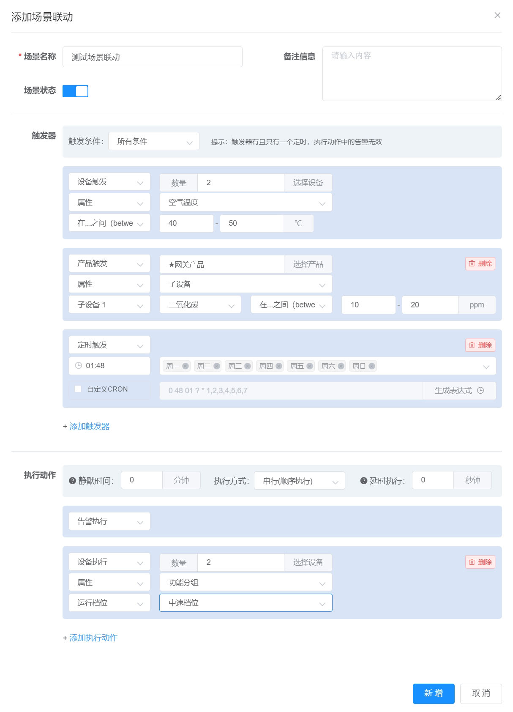
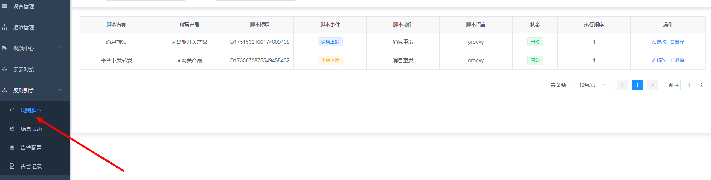
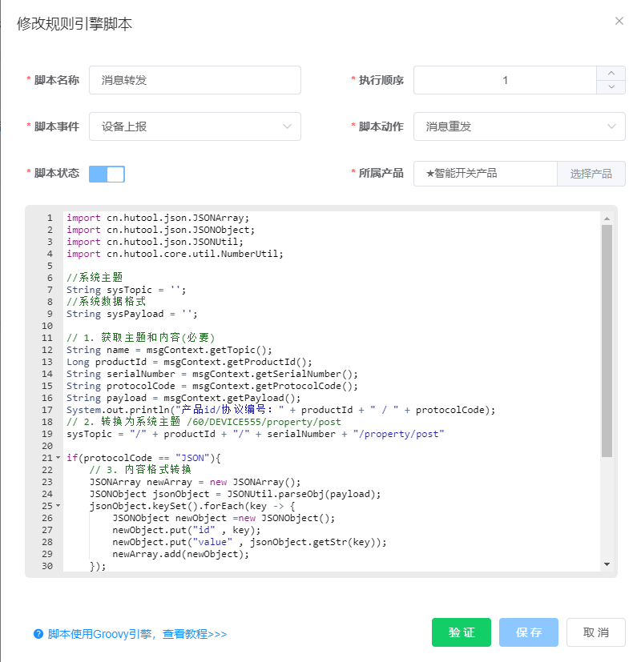
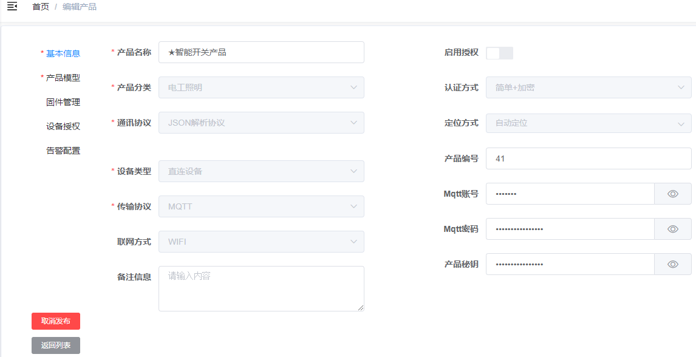
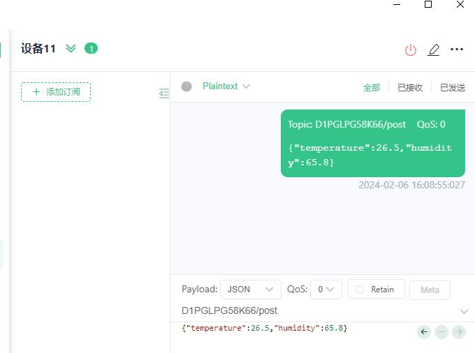
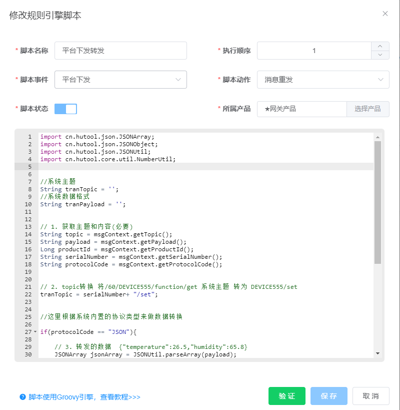
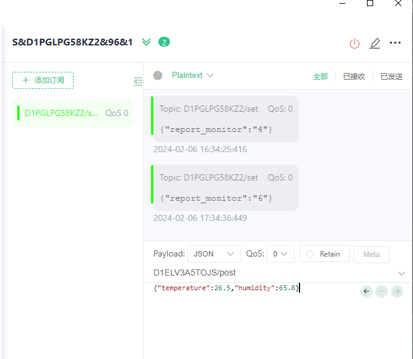

## 场景联动
场景联动可以通过可视化的方式定义设备之间联动的规则，配置界面如下：



**配置说明：**
1. 触发条件：所有条件，任意条件，不满足。所有条件需要所有触发器都满足才会去执行动作，任意条件满足其中一个即可，不满足只能包含一个触发器。
2. 触发方式：设备触发，产品触发，定时触发。设备触发可以指定一个或多个设备触发，产品触发时产品下面所有设备都会去匹配规则，定时触发使用cron表达式定时执行一次。
3. 动作方式：设备执行，产品执行，告警执行。设备执行可以指定一个或多个设备执行，产品执行时产品下面所有设备都会去执行动作，告警执行时查询该场景匹配的告警配置，执行消息通知。
4. 静默时间：指定的时间范围内只会执行一次动作，单位分钟。
5. 执行方式：串行，并行。串行时动作按照顺序依次执行，并行时动作一起执行。
6. 延时执行：延时执行动作，时间限制为90秒，指定时间范围内，如果服务端意外停止，重启后不会再去执行。

::: tip 
新建的场景中包含告警执行，告警配置中可以关联该场景，满足触发条件后会发送告警短信/语音/邮件，微信/钉钉通知等，具体根据告警的配置

:::

## 规则脚本

#### 一、脚本语言
::: tip
规则脚本采用Groovy编写，是一种基于JVM(Java虚拟机)的敏捷开发语言，Groovy代码能够与Java代码很好的结合，也能用于扩展现有代码。
:::

Groovy的语法与 Java 语言的语法很相似，完成同样的任务所需的代码比 Java 代码更少。可以将它想像成 Java 语言的一种更加简单、表达能力更强的变体，基本上可以直接使用Java代码编写脚本。

#### 二、新建规则脚本

规则脚本列表<br />


编辑规则脚本<br />


**配置说明：**
1. 脚本事件：设备上报（已支持）、服务下发（已支持）、设备上线、设备离线 
2. 脚本动作：消息重发（已支持）、消息通知、Http推送、mqtt桥接、数据库存储
3. 所属产品：规则脚本跟产品绑定，只会影响产品下面的设备
4. 脚本顺序：产品下面有多个脚本，按照顺序执行

#### 三、规则脚本基础示例
```java
import cn.hutool.json.JSONArray;
import cn.hutool.json.JSONObject;
import cn.hutool.json.JSONUtil;
import cn.hutool.core.util.NumberUtil;

// 1. 获取主题/消息内容/设备编号/协议编码
String topic = msgContext.getTopic();
String payload = msgContext.getPayload();
String serialNumber = msgContext.getSerialNumber();
String protocolCode = msgContext.getProtocolCode();

// 2. 数据转换(自己处理)
println ("根据情况转换处理数据")
String NewTopic = topic;
String NewPayload = payload;

// 3. 返回新的数据
msgContext.setTopic(NewTopic);
msgContext.setPayload(NewPayload);

```

::: tip

1. 默认仅使用hutool的Json处理和数字工具类库，hutool其他类库或者系统相关类库，需要后端开放一下；
2. 默认禁止使用For/While循环和IO操作等，根据情况可以后端开放；
3. 通过msgContext获取和设置主题和消息内容；
4. 主题和消息内容如何转换需要自己编写。
:::

规则脚本通过上下文 `MsgContext` 存取数据。脚本中可以通过 `msgContext` 获取值和重新设置新的值，系统定义的上下文如下：

```java
public class MsgContext {

    /** 消息主题 */
    private String topic;

    /** 消息内容 */
    private String payload;

    /** 设备编号 */
    private String serialNumber;

    /** 产品ID */
    private Long productId;

    /** 协议编码 */
    private String protocolCode;
}
```

#### 四. 设备上报示例

我们创建一个产品，产品选择JSON协议



按照**平台处理上报数据的系统主题和系统数据格**式分别是：

```json
Topic: /96/D1ELV3A5TOJS/property/post

[
  {
    "id": "temperature",
    "value": "26.45"
  },
  {
    "id": "humidity",
    "value": "65.8"
  }
]
```

**实际设备上报的数据格式和主题**分别是：

```json
Topic: D1ELV3A5TOJS/post
{
  "temperature": 26.5,
  "humidity": 65.8
}
```

此时，我们使用脚本转换主题和数据格式，我们新建一个脚本


脚本内容如下：

```java
import cn.hutool.json.JSONArray;
import cn.hutool.json.JSONObject;
import cn.hutool.json.JSONUtil;
import cn.hutool.core.util.NumberUtil;

//系统主题
String sysTopic = '';
//系统数据格式
String sysPayload = '';

// 1. 获取主题和内容，topic  S&D1PGLPG58K66/post
String name = msgContext.getTopic();
Long productId = msgContext.getProductId();
String serialNumber = msgContext.getSerialNumber();
String protocolCode = msgContext.getProtocolCode();
String payload = msgContext.getPayload();
System.out.println("产品id/协议编号：" + productId + " / " + protocolCode);

// 2. 转换为系统主题 /96/D1ELV3A5TOJS/property/post
sysTopic = "/" + productId + "/" + serialNumber + "/property/post" 

if(protocolCode == "JSON"){   
    // 3. 内容格式转换
    JSONArray newArray = new JSONArray();
    JSONObject jsonObject = JSONUtil.parseObj(payload);
    jsonObject.keySet().forEach(key -> {
        JSONObject newObject =new JSONObject();
        newObject.put("id" , key);
        newObject.put("value" , jsonObject.getStr(key));
        newArray.add(newObject);
    });
    sysPayload = newArray.toString();
}else{
    //其他协议处理
}

// 4.打印
System.out.println("新主题：" + sysTopic);
System.out.println("新内容：" + sysPayload);

// 5. 返回新的数据（必要）
msgContext.setTopic(sysTopic)
msgContext.setPayload(sysPayload);
```

脚本内容基本比较容易理解。我们编辑好脚本后，进行验证。运行一下看看效果。连接设备编号为：**S&D1PGLPG58K66**  的设备，按照如下格式发送:



我们看看脚本执行后的在控制台打印的结果：

```json
16:08:55.066 [MQTT-BROKER-6-5] INFO  c.y.l.c.FlowExecutor - [info,186] - [68bc37d0dffa41a8a25b1d8c1a63a8a5]:requestId has generated
16:08:55.066 [MQTT-BROKER-6-5] INFO  c.y.l.c.FlowExecutor - [info,193] - [68bc37d0dffa41a8a25b1d8c1a63a8a5]:slot[10] offered
16:08:55.066 [MQTT-BROKER-6-5] INFO  c.y.l.f.element.Node - [info,193] - [68bc37d0dffa41a8a25b1d8c1a63a8a5]:[O]start component[D1751532166174609408(消息转发)] execution
----------------------------------------------------------------------------------------
产品id/协议编号：41 / JSON
新主题：/41/D1ELV3A5TOJS/property/post
新内容：[{"id":"temperature","value":"26.5"},{"id":"humidity","value":"65.8"}]
-----------------------------------------------------------------------------------------
16:08:55.067 [MQTT-BROKER-6-5] INFO  c.y.l.c.ScriptCommonComponent - [info,200] - [68bc37d0dffa41a8a25b1d8c1a63a8a5]:component[D1751532166174609408(消息转发)] finished in 0 milliseconds
16:08:55.067 [MQTT-BROKER-6-5] INFO  c.y.l.slot.Slot - [info,200] - [68bc37d0dffa41a8a25b1d8c1a63a8a5]:CHAIN_NAME[dataChain]
D1751532166174609408[消息转发]<0>
```

可以看到topic和数据格式已经转换为系统主题和格式


#### 五. 服务下发转换示例

假设实际设备服务下发的主题和数据格式分别是：

```JSON
Topic: D1PGLPG58KZ2/set
{
  "report_monitor": "4"
}
```

平台系统主题和数据格式：

```json
Topic: /96/D1PGLPG58K66/property/post

[
  {
    "id": "temperature",
    "value": "26.45"
  },
  {
    "id": "humidity",
    "value": "65.8"
  }
]
```


新增脚本，定义如下：



我们看看脚本的定义内容：

 1.将系统主题转为真实设备需要的主题

2.将系统数据格式转为真实设备需要的主题

```java
import cn.hutool.json.JSONArray;
import cn.hutool.json.JSONObject;
import cn.hutool.json.JSONUtil;
import cn.hutool.core.util.NumberUtil;

//系统主题
String tranTopic = '';
//系统数据格式
String tranPayload = '';

// 1. 获取主题和内容
String topic = msgContext.getTopic();
String payload = msgContext.getPayload();
Long productId = msgContext.getProductId();
String serialNumber = msgContext.getSerialNumber();
String protocolCode = msgContext.getProtocolCode();

// 2. topic转换 将/60/DEVICE555/function/get 系统主题 转为 DEVICE555/set 
tranTopic = serialNumber+ "/set";

if(protocolCode == "JSON"){   
    // 3. 转发的数据  {"temperature":26.5,"humidity":65.8}
    JSONArray jsonArray = JSONUtil.parseArray(payload);
    JSONObject resultObj = new JSONObject();
    jsonArray.forEach(obj -> {
        JSONObject jsonObject = (JSONObject)obj;
        resultObj.put(jsonObject.getStr("id"),jsonObject.getStr("value"));
    });
    tranPayload = JSONUtil.toJsonStr(resultObj);  
    
}else{
    //其他协议处理
}

// 4.打印
System.out.println("转发主题：" + tranTopic);
System.out.println("转发内容：" + tranPayload);

// 5. 返回新的数据（必要）
msgContext.setTopic(tranTopic);
msgContext.setPayload(tranPayload);
```

我们下发指令来测试一下转换情况，后端日志内容如下：

```
17:34:36.439 [functionInvokeTask2] INFO  c.y.l.c.FlowExecutor - [info,186] - [6481bf113e15499aabe550189d16f4a5]:requestId has generated
17:34:36.440 [functionInvokeTask2] INFO  c.y.l.c.FlowExecutor - [info,193] - [6481bf113e15499aabe550189d16f4a5]:slot[13] offered
17:34:36.440 [functionInvokeTask2] INFO  c.y.l.f.element.Node - [info,193] - [6481bf113e15499aabe550189d16f4a5]:[O]start component[D1753673875549458432(平台下发转发)] execution
-------------------------------------------------
转发主题：D1PGLPG58KZ2/set
转发内容：{"report_monitor":"6"}
-----------------------------------------------
17:34:36.440 [functionInvokeTask2] INFO  c.y.l.c.ScriptCommonComponent - [info,200] - [6481bf113e15499aabe550189d16f4a5]:component[D1753673875549458432(平台下发转发)] finished in 0 milliseconds
17:34:36.440 [functionInvokeTask2] INFO  c.y.l.slot.Slot - [info,200] - [6481bf113e15499aabe550189d16f4a5]:CHAIN_NAME[dataChain]
```

客户端订阅接收内容如下：



至此，将系统主题和数据格式转换为设备所需主题和格式验证成功。


#### 六、Http推送

#### 七、Mqtt桥接

#### 八、消息通知


## 相关文档
* <a href="https://liteflow.cc/" target="_blank" rel="nofollow">LiteFlow-轻量，快速，稳定可编排的组件式规则引擎</a>
* <a href="https://doc.hutool.cn/pages/JSONUtil/" target="_blank" rel="nofollow">Hutool是一个小而全的Java工具类库</a>


