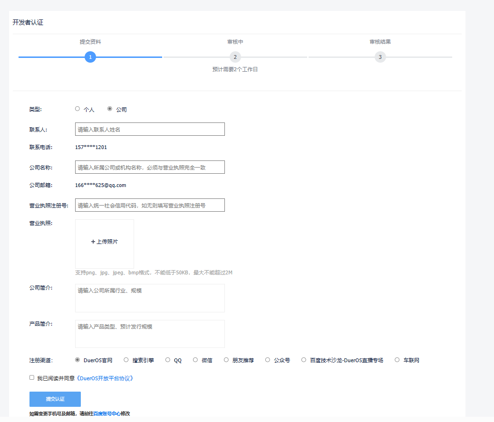
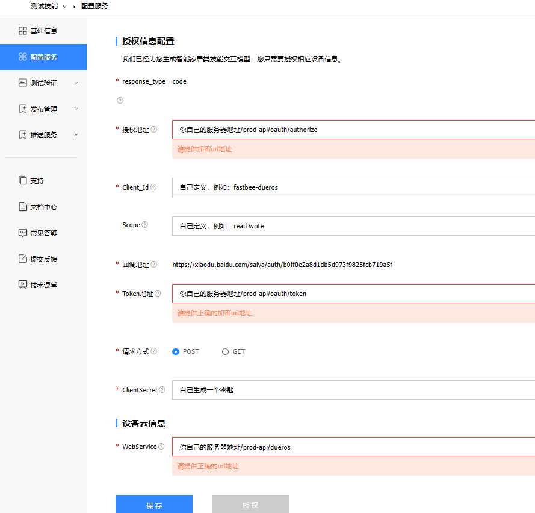
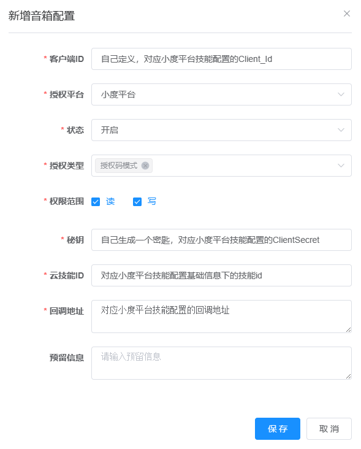

::: tip
* 智能音箱是单独付费模块
* 云云对接智能音箱，目前已支持小度平台的大部分功能
:::

<iframe id="embed_dom" name="embed_dom" frameborder="0" style="display:block;width:100%;height:600px;" src="https://www.processon.com/embed/6561581833955724ba6e53a1"></iframe>

### 一、准备工作

1. 申请一个百度账号，然后登录dueros开放平台https://dueros.baidu.com/open进行开发者认证，必须要进行公司认证，才可申请技能。

   

2. 认证成功后，即可创建技能

  
注意：因为技能要求服务器地址必须是url加密（https）的。如果需要在本地启动服务调试，则需要在把本地后端项目启动后进行内网穿透到一个加密地址，然后把下面的服务器地址改为你穿透的地址，在代码相应接口打断点就可以调试了。同理，如果要把技能上线，也需要保证你的服务器地址是加密的。

  

3. 系统管理-云云对接-音箱配置

  

### 二、音箱对接

1. 产品关联小度设备类型（用于小度识别设备类型）

2. 产品物模型对接小度定义的属性，一个物模型唯一对应一个属性，属性值关联物模型的值，并返回给小度；

   **注意**：选择关联属性时：

   * 默认属性值直接关联物模型的value值，使用物模型的value值作为小度的属性值返回；

   * 物模型单位需配置为和属性单位一样或者不配，优先取物模型配置的单位，和小度属性单位不一致会报错，没有配置则取属性默认单位；

   * 部分小度属性返回值为枚举或对象，返回值是官方定义好的，所以需要进行属性值和物模型值关联操作，需自行配置，目前支持枚举值对应、物模型id对应（对象类物模型）；

     枚举值对应：例如小度开关属性 turnOnState，其属性值为 "ON"（打开） 、"OFF"（关闭）；

     ​						关联物模型 switch，其物模型值为 "1"(打开)、"0"(关闭)；

     ​						需进行值关联操作：{'ON':'1','OFF':0}

     对象对应：例如小度颜色属性 color，其包含三个子属性，分别为"hue"（色相）、"saturation"（饱和度）、"brightness"（明度）；

     ​					必须关联对象类物模型 object，其也包含三个子物模型，子物模型id分别为"object_hue"(色相)、"object_saturation"(饱和度)、"object_brightness"(明度)；

     ​					需进行子属性标识和子物模型id对应：{"hue":"object_hue","saturation":"object_saturation","brightness":"object_brightness"}，然后子属性值直接关联子物模型值，并返回给小度；

     ​      

3. 产品物模型对接小度定义的动作：一个物模型对应多个动作，该动作主要用于语音识别控制属性关联的物模型；

### 三、使用教程

1. 配置前建议先阅读项目fastbee-speaker/file/小度对接文档，然后进行配置

2. 入口主页面：

   选择菜单云云对接-小度音箱进入，先点击新增按钮，选择需要关联的产品，点击关联按钮会把产品下的物模型先关联进来；

3. 关联产品详情页面：

   - 刷新按钮：当产品新增物模型后，可点击进行关联，物模型如果修改过，建议先把关联的物模型删除，然后点击刷新重新关联进来
   - 关联物模型编辑按钮：进入配置页面：（1）参照excel文档先选择关联属性，会自动匹配一些动作（匹配后就不可修改动作）；（2）部分属性返回值需关联物模型值，需参照属性值然后再根据物模型值进行配置关联；

5. 使用文档：

   当以上配置做完后，参考小度对接文档语音指令，就可以通过语音来控制设备了

### 四、后续更新

1. 部分复杂动作还未实现，后续进行更新
2. 报警模块上报物模型值给小度音箱，后续进行更新
