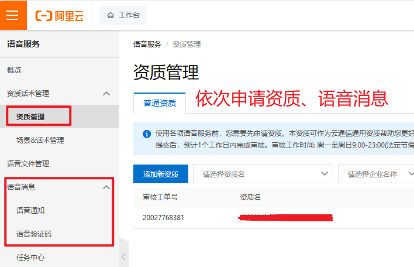

## 一、消息通知

1. 概述：消息通知是单独的一个模块，包含通知渠道、通知模板、通知日志三个菜单，模板通过关联业务编码，可灵活的对接其他模块业务；

2. 技术实现：短信、邮箱发送使用第三方开源技术[首页 | SMS4J文档](https://sms4j.com/)，其他渠道发送使用官方api文档。

   

3. 申请流程：

    * 阿里云短信、语音

      

      

      

   * 腾讯云短信、语音
      
      

      

      

   * 微信小程序订阅模板申请，参考三方登录先申请微信小程序，然后登录微信公众平台微信小程序申请订阅消息
     
     **注意**：微信小程序通知必须要配置模版，并启用，然后用户需要小程序告警待处理页面点击处理，然后订阅消息，可以自己调整订阅位置

     
    
     

   * 企业微信应用信息、群机器人（注意：目前仅支持在企业内部创建使用，还未测试过第三方）

     

     
    
     

     
    
     **注意**：企业微信应用消息必须要验证URL通过后才可发送通知，在下面的代码改为自己的信息，然后部署项目验证，验证成功后再配置可信域名、可信IP就可以了

     

   * 微信公众号通知

     实现前提：系统已经有微信绑定功能，并且微信公众号需和微信网站应用、小程序、移动应用绑定在同一个微信开放平台账号下，不同应用端通过unionId交互；
   
     **注意**：1、在微信开放平台申请公众号，然后去微信公众平台绑定公众号；2、在系统三方登录配置微信公众号信息；3、验证url，验证通过后配置IP白名单；4、上功能线后已关注公众号的微信需重新关注；

     
    
     
      
   * 钉钉消息通知、群机器人（注意：目前仅支持在企业内部创建使用，还未测试过第三方）
   
     

     
    
     
    
     **注意**：需要在机器人设置、安全设置里修改IP地址段，一般为后端服务器部署地址
     

## 二、通知渠道

1. 概述：通知渠道配置主要用于对接第三方渠道服务商的连接参数，一个渠道可配多个通知模版。

2. 定义：渠道、服务商来源于字典数据，服务商需严格按照已有字典类型格式配置：

   
3. 差异：不同渠道服务商配置参数有差异，可查看该枚举类**NotifyChannelProviderEnum**，可自行调整
    
   配置参数来源方法com.fastbee.common.enums.NotifyChannelProviderEnum#getConfigContent

   **注意**：务必保证属性（attribute）参数名和各渠道对应配置类里的属性名一致

   

## 三、通知模版

1. 概述：通知模版主要配置模版参数，模板归属于通知渠道（配置模板时需选择对应已配好的通知渠道账号），同时也要选择相应的业务编码，配好后在列表里启用；

2. 差异：不同渠道模版参数有差异，可查看该枚举类**NotifyChannelProviderEnum**，可自行调整
   配置参数来源方法com.fastbee.common.enums.NotifyChannelProviderEnum#getMsgParams

   **注意**：务必保证属性（attribute）参数名和各渠道对应配置类里的属性名一致

   
   
3. 发送账号：所有模版发送账号统一使用**sendAccount**字段保存，多个使用‘,’分隔

4. 内容变量：所有模版正文内容统一使用**content**字段保存，目前只支持**content**字段内容里存在变量
   
   变量符号：微信小程序使用符号{{}}，腾讯云短信、语音使用符号{}，邮箱使用符号#{}，其余使用${}表示

   **注意**：需要把第三方申请的模版内容**原样**复制过来（方便记录完整的日志内容），例如：

* 微信小程序订阅模板内容复制

  

* 短信语音模板内容复制

  

## 四、通知日志

1. 概述：记录所有通知模版发送的日志，包括发送内容、账号、返回内容；

   

## 五、业务对接

1. 概述：唯一启用模版原则：短信、语音、邮箱以业务编码+渠道保证唯一启用，微信、钉钉以业务编码+渠道+服务商保证唯一启用。

2. 对接：已对接设备告警，短信登录验证码业务。如需添加业务，可同时在字典数据通知业务编码和通知业务枚举类**NotifyServiceCodeEnum**里自行添加。

   

3. 测试：在配置好模版后，可点击测试按钮，检测是否能发送成功。

   

4. 发送服务类：主要对接不同渠道服务商的发送

   

5. 业务通知：主要对接业务发送，有新业务可写在这。

   

   重点：
   * 已统一发送方法，com.fastbee.notify.core.service.NotifySendService#notifySend，可直接调用
   * 已统一查询启用模版方法，com.fastbee.notify.core.service.NotifySendService#selectOnlyEnable，可直接调用
   * 如需加业务通知，只需自己组装一下内容变量和发送账号即可，参考统一发送方法入参类com.fastbee.notify.vo.NotifyVO

6. 注意：

* 在对接其他业务时，务必保证模版是**启用**的状态，否则会发送失败。

* 设备告警业务的通知模板，短信、语音、微信小程序会获取当前设备所属及分享的用户+模板配置的发送账号通知，其余需要在模板里面配置发送账号。

* 支持多个账号发送，微信小程序使用系统用户id（用户需要订阅模版，目前只需要配置了设备告警-微信小程序通知模板，并启用，然后在微信小程序告警页面订阅就行），企业微信应用消息使用企业通讯录成员账号名称，钉钉工作通知使用企业内部通讯录成员员工UserID，均用英文逗号‘,’分隔

* 模版内容存在**变量**的，需要把变量替换为真实的参数。目前已对接的业务，模版变量是按顺序替换的，因此在申请模版内容时，变量的顺序务必和我们演示站点模版变量顺序一致。如果需要修改发送变量，可自行参考以下代码调整：

## 六、后续更新

1、新增其他还未实现的渠道服务商通知配置；

2、新增其他通知业务；

3、考虑接入mq
