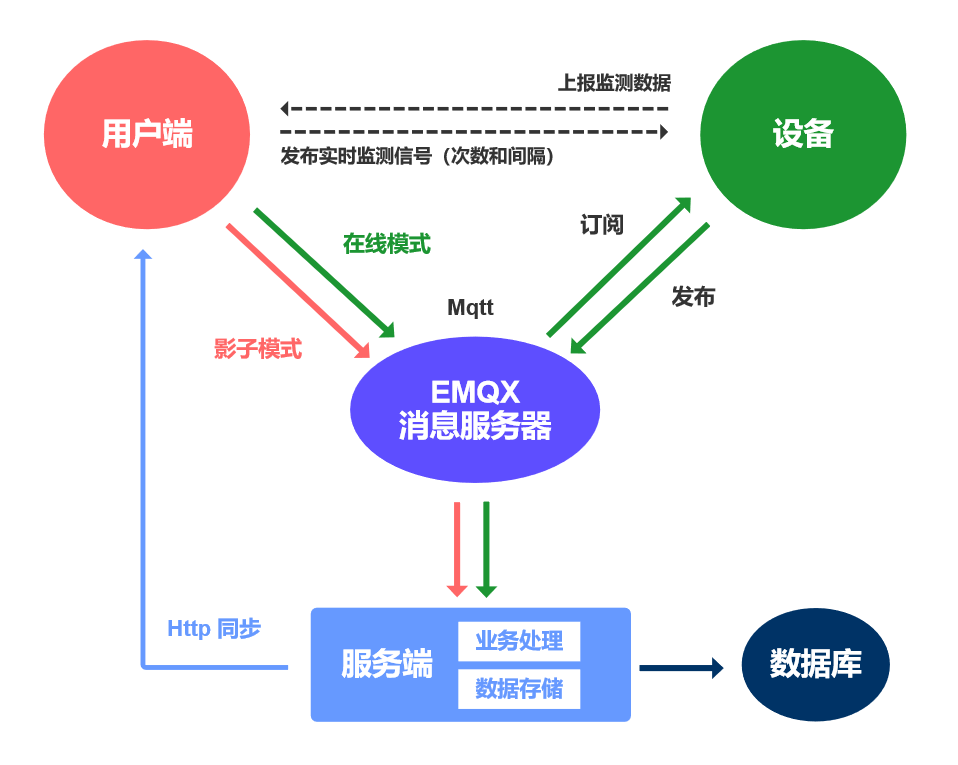

::: warning
仅适用于V2.0之前版本
:::
##### 1. 设备发布属性、功能和事件，服务端订阅后存储到数据库

##### 2. 用户界面对设备的控制分为在线模式(设备在线)和影子模式(设备离线)。
* **在线模式：** 用户端发布属性和功能消息，设备端订阅到消息并作出响应。最后设备发布属性和功能消息，服务端订阅后存储。
* **影子模式：** 用户端发布属性和功能消息，后端订阅并存储。设备上线后，后端发布变更的属性和功能消息，设备端订阅并作出响应。
    
##### 3. 用户端通过同步功能，可以获取设备最新的状态

 

##### 4. 实时监测消息是用户端和设备直接交互，不会存储数据。
* 用户端发送实时监测信号，包含次数和间隔。设备订阅该实时监测信号。
* 设备根据订阅到的实时监测信号次数和间隔，发布实时监测数据。用户端订阅该监测数据，并实时显示。

##### 5.EMQX的客户端认证
服务端、web端、手机端和设备端都是一个mqtt客户端，需要一个账号密码来连接EMQX。系统使用EMQX的HTTP认证插件，约定clientId的起始部分为他的来源，如服务端的clientId以 `server-` 开头，前端以 `web-` 开头，移动端的以 `phone-` 开头，设备端根据加密方式以 `S` 或 `E` 开头。

* 服务端根据后端配置的Mqtt账号密码认证
* web端和phone端使用token认证
* 设备端根据产品信息里面的Mqtt账号、密码、密钥和加密方式认证

##### 6.EMQX钩子实现设备上线和下线
* 在物联网中由于硬件或网络原因，设备可能频繁上下线。当设备离线时，用户发送指令，设备是接收不到的，如果启用影子模式该指令会存储到redis中，等到设备上线时执行，下发给设备。

* 系统中设备上下线的监控是由EMQX webhook来实现的，当检测到设备上下线时就会调用 `http://localhost:8080/iot/tool/mqtt/webhook` 接口，更新设备上下线状态，上线时如果设备启用影子模式，就把离线后的操作下发给设备。

