::: tip
Modbus设备可以使用云端轮询和边缘网关两种方案
:::

#### 一、云端轮询实现

* 方案实现原因：普通的dtu或模组一般只有实现mqtt或tcp的透传功能，如果设备使用modbus协议，不外加边缘网关的情况，modbus协议的设备数据不会主动上报，因此云端根据产品对应的采集点模板，组装modbus读指令下发到对应的设备，进行modbus轮询。
* 由于设备上报modbusRTU报文没有寄存器标记位，需要标记报文。
* 目前采用的标记方式是加给线程加redis锁，，等待设备返回报文。报文如下：

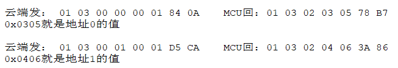

实现方式如下：

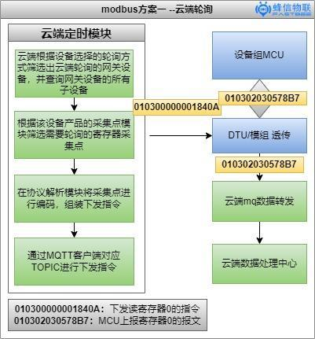


##### **Modbus协议的解码编码**

###### 1. 平台代码

<span dir="">在fastBee平台中，后端对该报文的解码编码在下图所示位置</span>

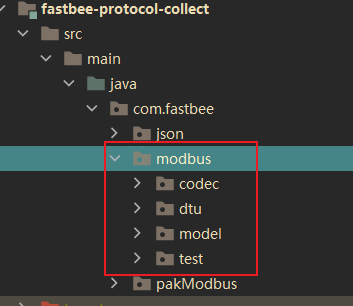


###### 2.注解实现解码编码

<span dir="">在平台中 ，封装了一套以注解方式解码编码硬件设备报文的基础包，针对各种各样的硬件设备报文，都可以使用这种注解方式去实现解码编码，</span>

<span dir="">减少后端开发人员在报文数据解码编码中繁琐的问题。</span>

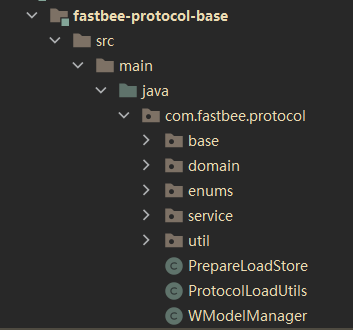

<span dir="">下面看下对应封装了一层的 \*\*“包装的modbus协议” ，\*\*使用注解方式如何做到解码编码</span>

<span dir="">首先看下注解 **@Column**的字段如何定义：</span>

<span dir="">这里使用字段</span>

1. <span dir="">length 指定类型长度</span>
2. <span dir="">version 这里用于区分是下发的报文还是上报的报文</span>
3. <span dir="">totalUnit 该字段的前置数量单位 （用于解析批量读返回的报文）</span>

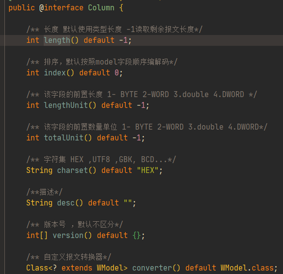

**注解定义解码编码modbus协议**

如果你不关心报文如何解析，可以跳过这里

**代码如下：**

1. int： 使用**INT类型**表示 **1个字节**的报文长度 ，这里**INT类型相当于byte类型**(在Java，INT类型占用字节为4个字节，这里INT类型会被按照2个字节进行解析)

2. totalUnit： 表示该字段的前置数量单位，例如 totalUnit = 1 ，总数据长度为 n，数据列表数为 BYTE\[2 \* n\]
3. version : 此处用于控制指令类型：

   ```
   a.当有version值时，需要符合条件时该字段才会被解码编码

   b. 没有version标记时，都参与解码编码。

      version =0  ：表示设备上报时，该字段才会被解析

      version = 1 ：表示读寄存器报文时，该字段才会被解析

      version =2  ：表示写单个保持寄存器时， 该字段才会被解析
   ```
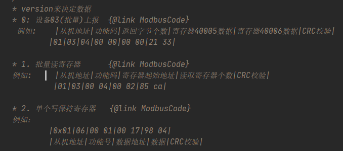

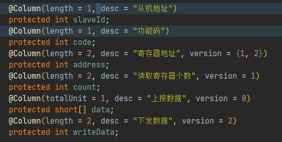


###### 3. 后端实现云端轮询

后端使用定时器方式实现modbus轮询。


* modbus云端轮询的后端入口，如下图所示

* 筛选在线的网关设备，根据产品定义的采集点，批量下发读指令。

* 使用线程池方式，把每一个子设备所有要下发的指令放在同一个子线程下发，使用redis缓存作为线程的锁也同时作为寄存器的标记内容，对于每一个子线程对应一个子设备，一个子设备对应多条需要批量读的下发指令，当下发指令时，子线程会不断加锁轮询，直到超过redis缓存设定的缓存时间，或者收到设备上报的数据时，才会继续下发该子设备的下一条指令。具体请参考后端代码。

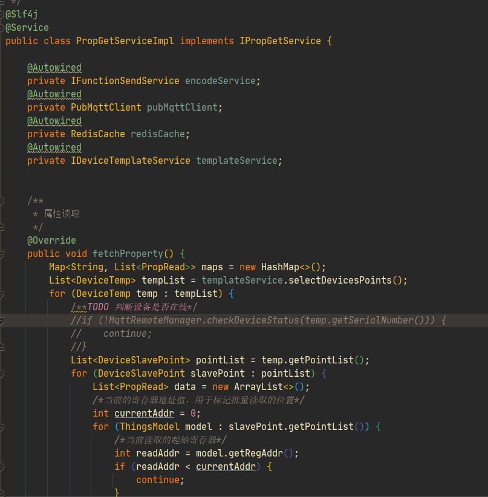


<br />

#### 二、边缘网关

::: tip
边缘网关配合云端采集（实时）
:::

##### 1. 方案介绍

由于modbus协议的特性，设备上报到云平台的报文，缺少可识别的寄存器地址值，所以平台识别不了寄存器地址所对应的物模型采集点，因此为了提高采集效率，和采集数据的实时性，再考虑到通用性问题，这里方案考虑使用外加MCU芯片的做法，实现边缘网关。

实现硬件：

1. 用户自身的设备(MCU)
2. dtu或模组 （透传）
3. 外加单片机芯片 (modbus轮询，变化上报 (成本低))

dtu或者模组可以

##### 2. 报文数据

为了解决modbus原始报文寄存器地址的问题，外加MCU模块会对modbus协议再封装一层，<span dir="">设备数据组成：</span>

* **a. 设备主动上报数据组成:**

FFAA ： 外加的报文头，保证消息完整

0D : 外加报文尾，保证消息完整

0001：寄存器地址，用于标识消息

010302030578B7 ： 原始modbus报文

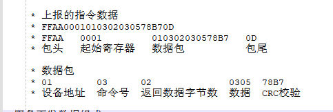

* **b. 服务下发数据组成**

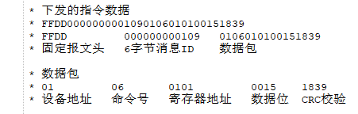

* **c. 设备应答服务下发数据组成**

modbus协议设备在收到写指令执行完成时，会将下发的写指令主动上报给平台表示已经执行成功。

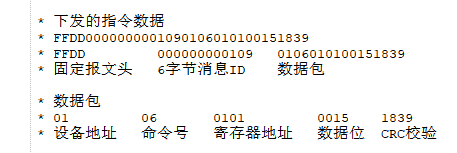

##### 3. 总体流程图如下：

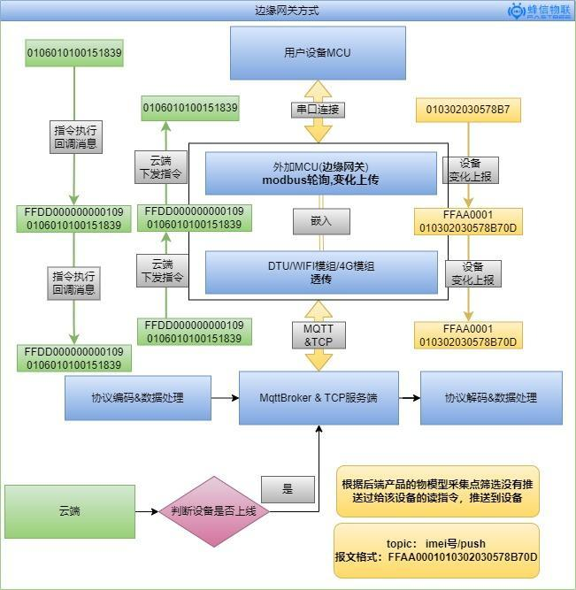

##### 4. 平台代码

在fastBee平台中，后端对该报文的解码编码在下图所示位置

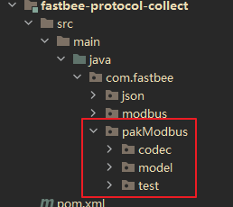

###### 注解实现解码编码

在平台中 ，封装了一套以注解方式解码编码硬件设备报文的基础包，针对各种各样的硬件设备报文，都可以使用这种注解方式去实现解码编码，

减少后端开发人员在报文数据解码编码中繁琐的问题。

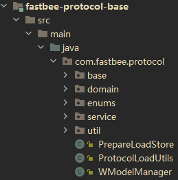

下面看下对应封装了一层的 \*\*“包装的modbus协议” ，\*\*使用注解方式如何做到解码编码

首先看下注解 **@Column**的字段如何定义：

这里使用字段

1. length 指定类型长度
2. version 这里用于区分是下发的报文还是上报的报文
3. totalUnit 该字段的前置数量单位 （用于解析批量读返回的报文）

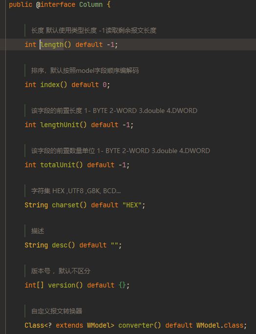

下面看下这个报文的定义

在java中，所有的基础数据类型是不存在有符号无符号，

* int： 使用**INT类型**表示 **1个字节**的报文长度 ，这里**INT类型相当于byte类型**(在Java，INT类型占用字节为4个字节，这里INT类型会被按照2个字节进行解析)

   **在下面定义中 FFDD 是两个字节，length=2 ，用int类型定义表示一个字节，那么这个字段的解析长度为： 2个字节**
* short：**表示两个字节**，modbus数据位的组成是2个字节，用 short\[\] 表示是short数组，这里兼容了单个和批量解析报文里面的数据位。

   最终解析出来的每个数据存放在 data数组中
* totalUnit： 表示该字段的前置数量单位，例如 totalUnit = 1 ，总数据长度为 n，数据列表数为 BYTE\[2 \* n\]

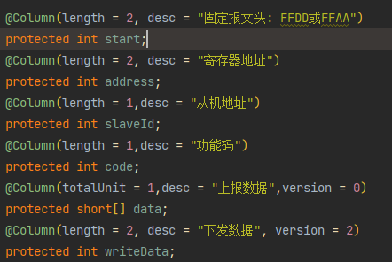

###### 注解方式解码编码测试

后端代码测试类为\*\*：<span dir="">PakModbusTest </span>\*\*，如下图所示。

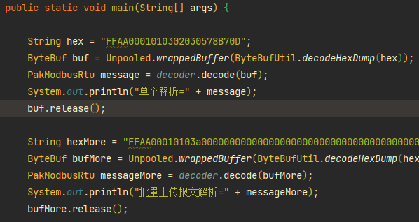

结果如下:

**单个上报解析**=读保持寄存器(字节读写模式)\[,slaveId\[从机地址\]=1,code\[功能码\]=3,length\[返回数据个数\]1,data\[上报数据\]=\[773\],address\[寄存器地址\]=1,writeData\[下发数据\]=0\]

**批量上报报文解析**=读保持寄存器(字节读写模式)\[,slaveId\[从机地址\]=1,code\[功能码\]=3,length\[返回数据个数\]80,data\[上报数据\]=\[0, 0, 0, 0, 0, 0, 0, 0, 0, 0, 0, 0, 0, 0, 0, 0, 0, 0, 0, 0, 0, 0, 0, 0, 0, 16384, 0, 0, 0, 3327, 924, 32, 0, -1, -1, 0, 110, 0, 0, 0, 0, 0, 0, 0, 0, 0, 0, 0, 0, 0, 0, 0, 0, 0, 0, 0, 0, 0, 0, 0, 0, 0, 0, 0, 0, 0, 250, 0, 0, 0, 0, -55, 16, 25, 30, 16, 25, 25, 87, 7\],address\[寄存器地址\]=1,writeData\[下发数据\]=0\]