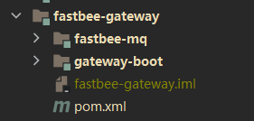
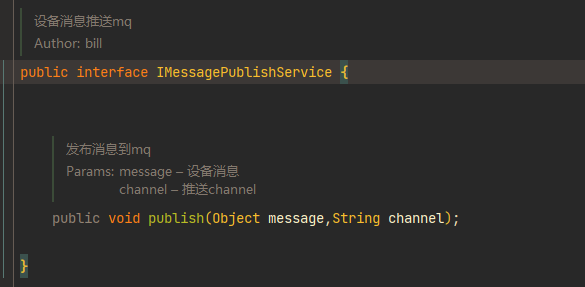
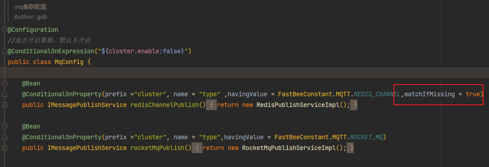
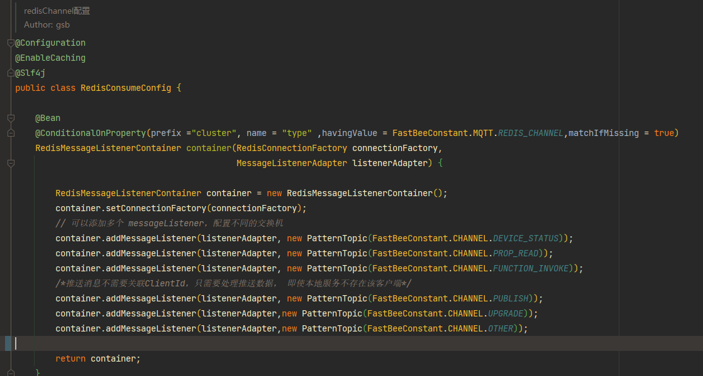
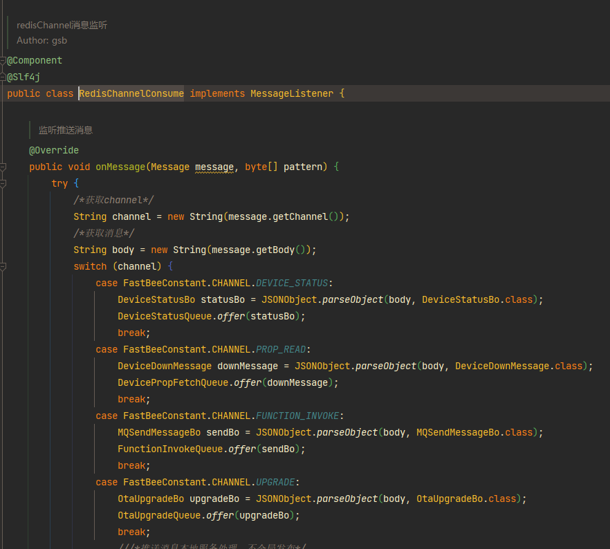
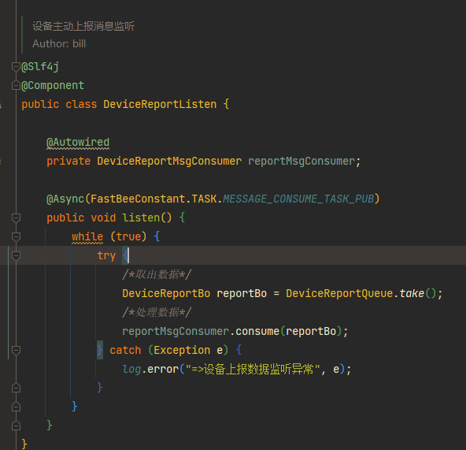

2.0版本新增了网关模块，网关模块是 协议的解码编码，数据转发，数据计算，以及持久化存储功能集合。

模块如下图所示

1. gateway-boot 是网关的启动模块
2. fastbee-mq 是网关的核心模块



**网关的数据进入口**

如下图所示：



网关的mq使用两种方式

1. redisChannel  + 本地队列
2. RockerMq

由下面的配置切换 ，默认使用redisChannel方式

```
#配置
cluster:
 enable: true
 type: redis
```



经过数据接口转发，然后根据channel分发数据，这里以redisChannel为例列举：

注册所需通道： 



消息进入通道后，进行消息分发：



消息进入消费队列，在消费队列中进行数据处理。

