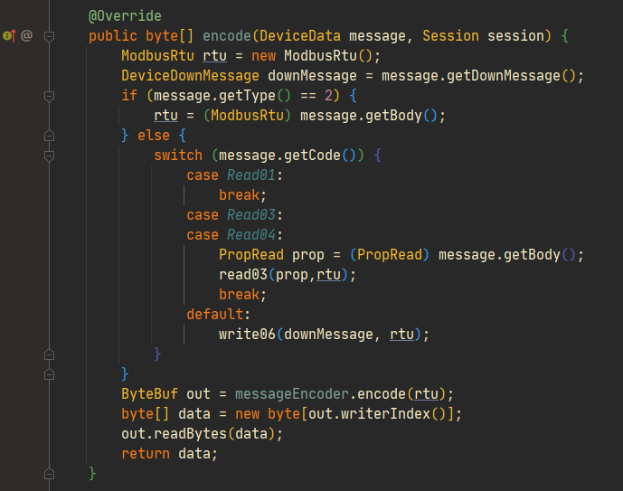

#### 协议管理模块

在2.0版本中，新增了协议管理模块来管理**硬件设备协议**，如下图所示：

fastbee-protocol-base ： 协议解析基础模块，该模块是注解方式实现解码编码的核心模块，用户无需关心如何实现。

fastbee-protocol-collect：协议集合模块，目前集合了 json，modbus-rtu，封装过的modbus-rtu的解码编码

#### 协议定义

在前端展示如下图所示：

如果需要在协议管理模块新增，系统是使用注解方式实现，注解定义如下

下面以**modbus-rtu协议新增代码**示例：

字段解析如下：

1. name  ：            协议名称
2. protocolCode： 协议编码，用于系统识别协议，与产品关联，一个产品对应一个协议编号。
3. description：     协议描述（选填）

当设备有数据来解码编码时，设备根据产品中的协议编号，与系统中协议匹配，则使用该协议进行解码编码

定义的解码示例如下：

而真正做解码的类是 ：**ModbusMessageDecoder**

定义的编码示例如下：

而真正做编码的类是 ：**ModbusMessageEncoder**

#### **协议注解方式解码编码**

在平台中 ，封装了一套以注解方式解码编码硬件设备报文的基础包，即 fastbee-protocol-base模块，针对各种各样的硬件设备报文，都可以使用这种注解方式去实现解码编码，

减少后端开发人员在报文数据解码编码中繁琐的问题。

注解 **@Column**的字段定义：

