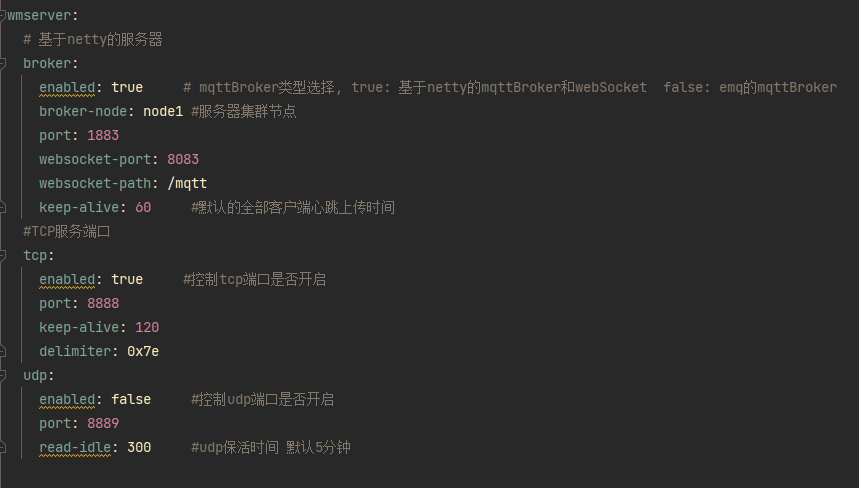
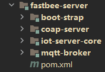
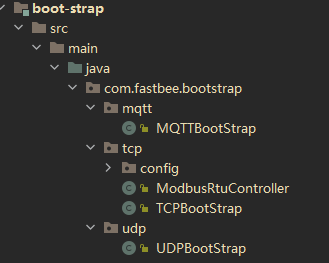
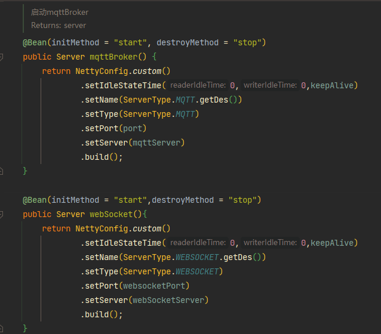
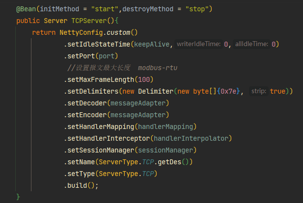
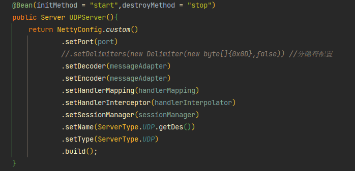

2.0版本更新，整合了以netty为基础架构的 MQTT ，TCP ，UDP 服务端，三个端的session，设备统一管理。

下面看下配置文件，如何启动和关闭服务，每个服务用enabled 来控制是否启动，其中mqtt和webSocket是一起启动关闭的

在后端代码中，服务端管理模块如下：

1.  boot-strap         管理各个服务端的启动
2. iot-server-core    搭建了tcp服务 和 udp服务，也是整合各个服务端的基本核心模块，包含session，基础解码编码，基础配置等信息
3. mqtt-broker        基于netty搭建的mqttBroker和webSocket服务

**统一的配置类，session管理**

整合的基础配置类 ： NettyConfig

session管理 ：           ISessionStore

**MQTT&WebSocket服务启动类** MQTTBootStrap

**TCP服务启动类**  TCPBootStrap

**UDP服务启动类**  UDPBootStrap

