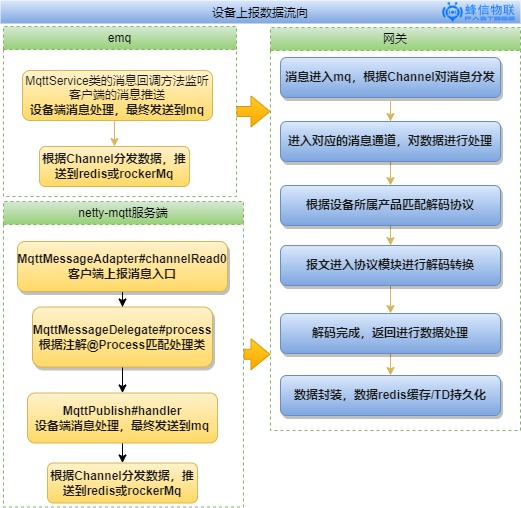
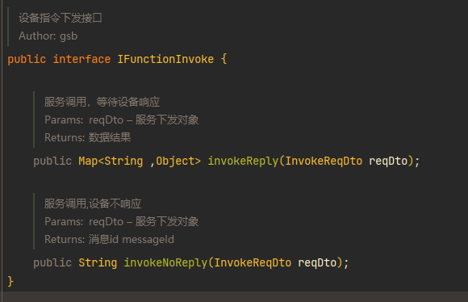
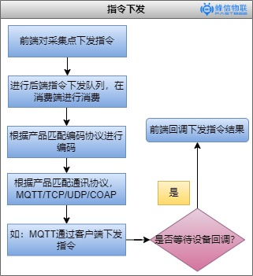

### 设备数据流向（设备上报）

硬件客户端通过dtu或者模组上报数据，从mqttBroker经过mq转发到网关模块，网关模块对设备数据匹配解析协议，进行数据解码，解码后数据进行约定的数据计算，数据计算后，最新一条数据将被redis缓存作为前端实时数据，将需要历史存储的数据持久化到TDengine

简化流程如下：

1.  emq -> mq ->网关 ->数据存储
2. netty-mqtt -> mq -> 网关 -> 数据存储

### 指令下发流程

通过前端或小程序下发指令，是通过http接口，发送到后端进行数据编码后，再发送至设备端执行

以mqtt下发指令为例：

后端提供两个接口，一个接口下发指令并等待设备响应数据，一个接口是直接下发指令不等待设备响应数据

下发的数据会进入队列，等待队列的消费者进行消费，消息端会首先会匹配设备的编码协议对下发的数据进行编码，然后根据设备的通讯协议进行下发到对应的服务端 

