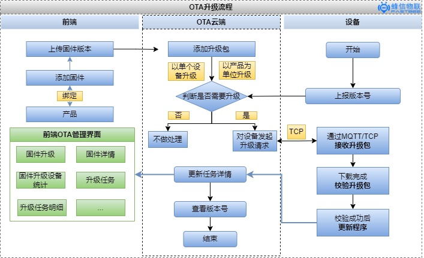
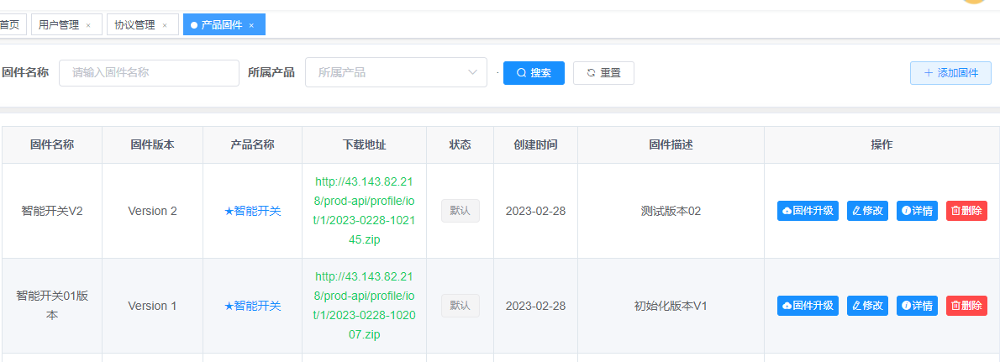
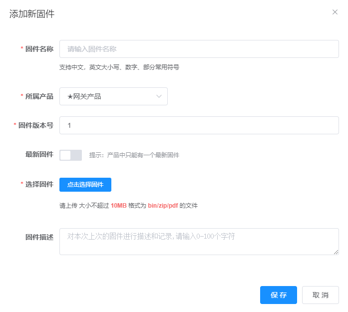
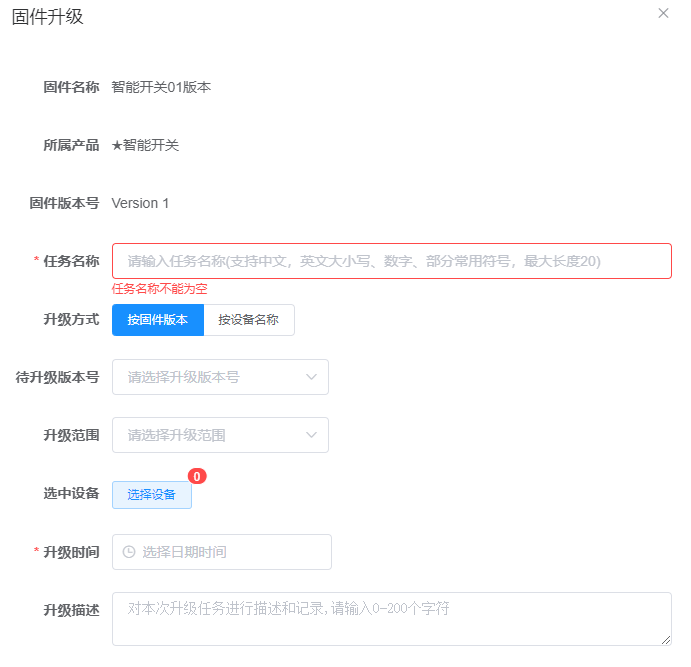
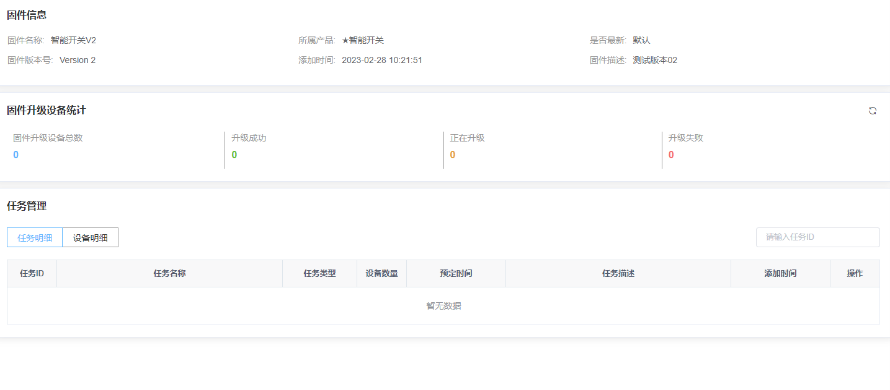

2.0版本重构OTA升级这块内容，整体流程如下：

在前端展示如下：

下面走一遍OTA升级的流程

点击 **添加固件** 新增产品固件，固件与产品一一对应，以产品为单位对固件进行管理

1. 选择固件对应的产品
2. 固件版本号填写
3. 点击选择固件上传至云平台

#### 固件升级

1. 选择固件版本
2. 选择升级方式，按固件版本/按设备名称
3. 选择升级版本号，选择需要升级的设备或整个产品的设备
4. 可以预定升级的时间，在升级时间预设

#### 固件升级详情

固件升级统计

升级任务管理/设备升级任务明细

