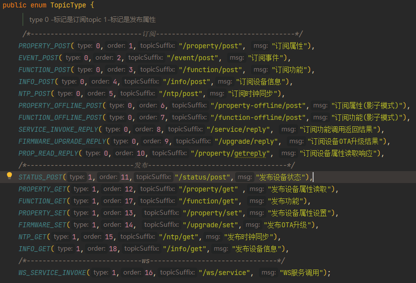
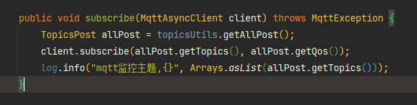
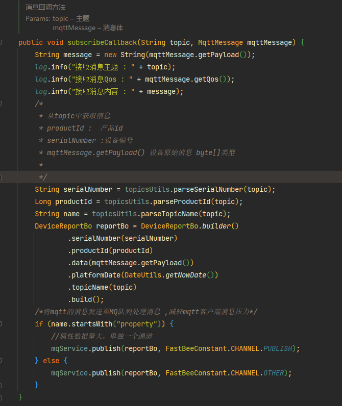
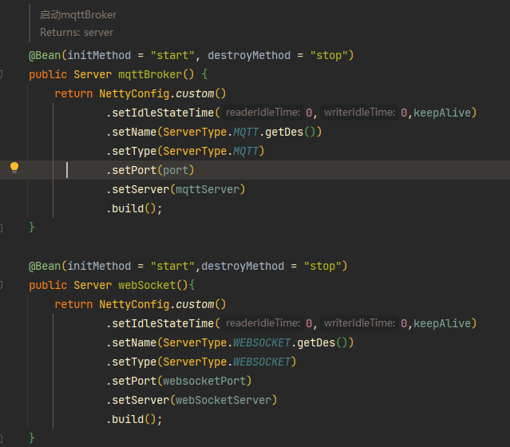
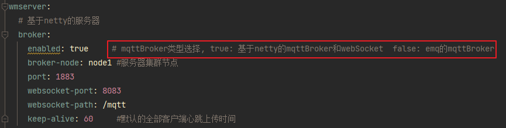

## mqtt的使用

2.0版本新搭建了基于netty的mqttBroker，同时也对使用emq进行的优化，

旧版本使用emq与新版本区别：

**topic管理**

topic管理将放在该类统一管理，标记是 发布topic/订阅topic

emq客户端订阅主题代码简化：将 TopicType类订阅属性全部进行订阅

消息回调方法更新：

接收到的消息，将会根据需要，根据topic分Channel将消息缓存到网关模块进行消息处理，降低回调客户端的消息高峰，提高数据处理转发能力，数据处理效率。

**基于Netty搭建的MQTT**

基于redis进行集群搭建，后续会更高效率的方案搭建集群

启动类如下图所示

**emq与netty-mqtt的切换**

无论是使用emq还是 netty-mqtt，处理消息数据都一样。可以二选一，但不支持同时使用

控制使用哪个mqtt的配置是 ：

