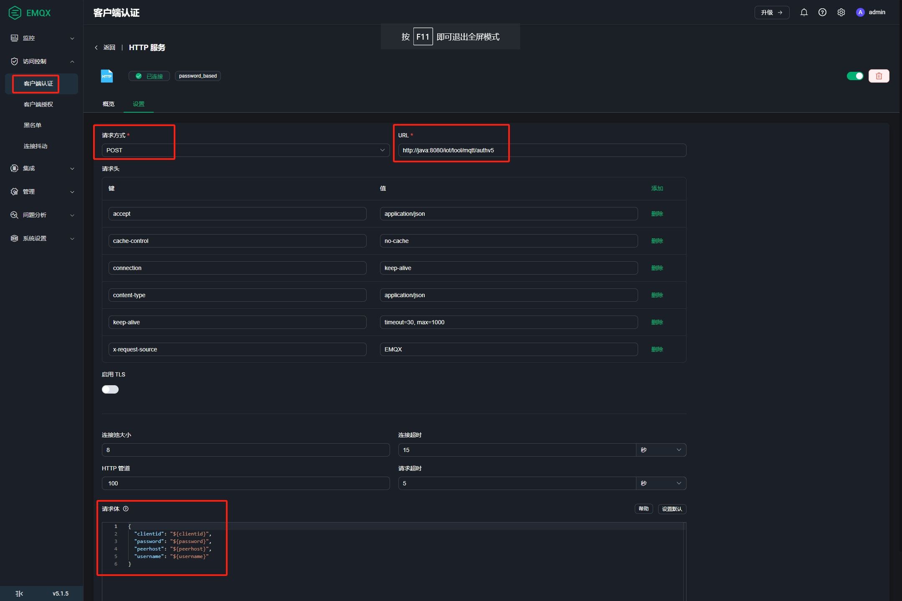
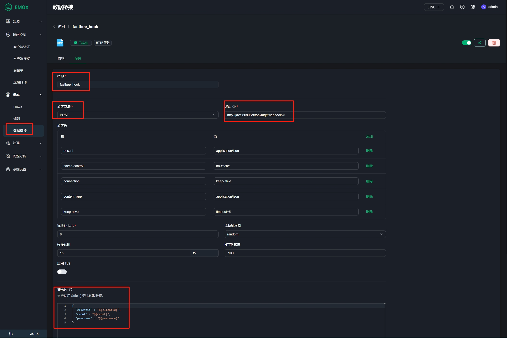
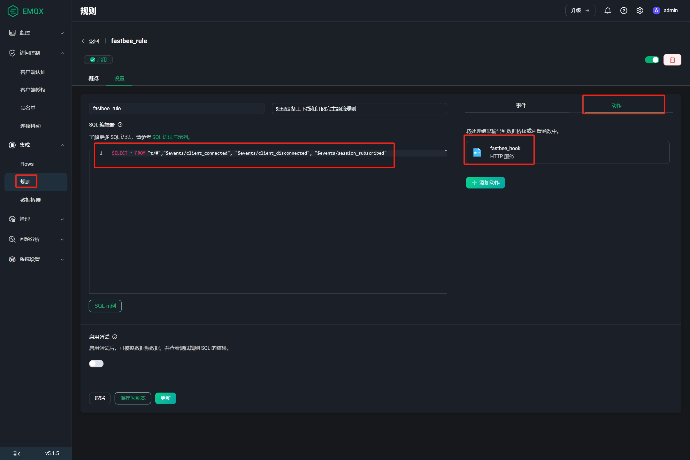

## 一、Docker安装Emqx5

```
docker run \
--name emqx \
--publish 1883:1883 \
--publish 8083:8083 \
--publish 8883:8883 \
--publish 8084:8084 \
--publish 18083:18083 \
--env TimeZone=Asia/Shanghai \
--volume /etc/localtime:/etc/localtime \
--restart unless-stopped \
--detach \
emqx:5.1
```
## 二、Emqx5配置
* **Emqx配置Http认证和Webhook（处理客户端上下线），有两种方式:**
  * 通过emqx.conf文件配置，已有配置好的文件位于 `docker/data/emqx/ect`文件夹；
  * 通过18083端口，打开Emqx控制台，创建客户端认证，数据桥接和规则

* **Emqx账号**
  * 控制台默认账号 (admin,public)
  * docker-compose方式部署，emqx.conf中配置的账号（admin，admin123）

::: tip 注意
Emqx控制台修改的账号，配置的Http认证、Webhook和规则会被emqx.conf中对应配置覆盖掉。官网解释如下：
* 通过 Dashboard、HTTP API 或 CLI 进行的更改将在运行时写入 data/configs/cluster.hocon 文件并立即生效。
* 如果相同的配置项在 etc/emqx.conf 文件中设置不同值，则在重新启动后，最终生效的是 etc/emqx.conf 中的配置。 为避免混淆，强烈建议不要在 cluster.hocon 和 emqx.conf 中具有相同的配置键。

emqx.conf配置文件中存在任何规则，设备消息转发的规则，也要配置在emqx.conf中。
:::

#### 配置文件方式
下面内容复制到emqx.conf文件中

```
# 设置控制台端口和默认账号
dashboard {
    listeners.http {
        bind = 18083
    }
    default_username = "admin"
    default_password = "admin123"
}

# http 认证
authentication  = [
  {
    mechanism = password_based
    backend = http
    enable = true
    method = post
    url = "http://177.7.0.13:8080/iot/tool/mqtt/authv5"
    body {
        clientid = "${clientid}"
        username = "${username}"
        password = "${password}"
        peerhost = "${peerhost}"
    }
    headers {
        "Content-Type" = "application/json"
        "X-Request-Source" = "EMQX"
    }
  }
]

# WebHook(匹配上线和下线规则后触发)
bridges {
  webhook.fastbee_hook  =
  {
    enable  =  true
    connect_timeout  =  15s
    retry_interval  =  60s
    pool_type  =  random
    pool_size  =  8
    enable_pipelining  =  100
    max_retries  =  2
    request_timeout  =  15s
    method  =  post
    url  =  "http://177.7.0.13:8080/iot/tool/mqtt/webhookv5"
    body  =  "{\"clientid\" : \"${clientid}\",\"event\" : \"${event}\",\"peername\" : \"${peername}\"}"
    headers  =  {  accept = "application/json"  "cache-control" = "no-cache"  connection = "keep-alive"  "content-type" = "application/json"  "keep-alive" = "timeout=5"}
  }
}

# 规则（处理上线和下线）
rule_engine {
  ignore_sys_message  =  true
  jq_function_default_timeout  =  10s
  rules.fastbee_rule  =  
  {
    sql  =  "SELECT * FROM \"t/#\",\"$events/client_connected\", \"$events/client_disconnected\", \"$events/session_subscribed\""
    actions  =  ["webhook:fastbee_hook"]
    enable  =  true
    description  =  "处理设备上下线和订阅完主题的规则"
  }
}
```
#### 控制台创建方式
1. **配置Http认证**



```
请求方式：POST

请求地址：http://177.7.0.13:8080/iot/tool/mqtt/authv5  （地址可以是内网或者外网，确保能访问）

请求Body:
{
  "clientid": "${clientid}",
  "password": "${password}",
  "username": "${username}",
  "peerhost": "${peerhost}"
}
```


2. **配置WebHook**

Webhook配置，先创建数据桥接，然后创建规则，规则跟数据桥接关联



```
数据桥接名称：fastbee_hook (随意填写)

请求方式：POST

请求地址：http://177.7.0.13:8080/iot/tool/mqtt/webhookv5 （地址可以是内网或者外网，确保能访问）

请求Body:
{"clientid" : "${clientid}", "event" : "${event}", "peername" : "${peername}"}
```



```
规则名称：fastbee_rule (随意填写)

SQL编辑器内容（分别代表客户端连接/断开连接/主题订阅完成）:
SELECT * FROM "t/#","$events/client_connected", "$events/client_disconnected", "$events/session_subscribed"  

动作：选择创建的数据桥接fastbee_hook
```


