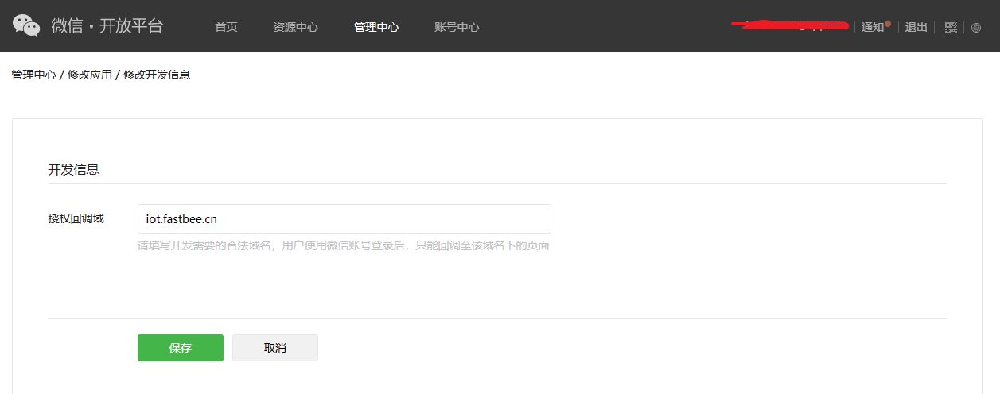

::: tip
目前已支持微信登陆，短信模块集成中...
:::

#### 一、微信登陆

##### 1. 准备工作
先去微信开放平台 https://open.weixin.qq.com/ 申请一个账号（注册需要营业执照），并申请网站应用和移动应用；微信小程序需要去微信公众平台 https://mp.weixin.qq.com/ 注册账号，并申请微信小程序，然后去微信开放平台绑定小程序；
::: tip
注意：一定要保存好每个应用的**appId**和**appSecret**，在系统后台：系统管理-三方登录配置需要用到，分别对应第三方平台申请ID和第三方平台密钥
:::

##### 2. 实现流程
由于**网站应用**和**移动应用**授权的微信用户信息没有手机号，找不到与之相关的系统账号，所以在**首次**使用微信登录时会跳转到绑定账号页面，后面流程如下：已有账号->则输入账号密码绑定，即可登录；没有账号->点击注册绑定，注册一个账号与微信绑定，然后重新登录即可

由于微信unionid唯一机制，首次在网站应用、移动应用任意一平台使用微信登录并绑定账号后，下次不管在哪一平台使用微信都可直接登录

* **网站应用**

配置：先在微信开放平台网站应用配置**授权回调域**，修改为自己后端接口请求IP地址或域名，eg: **iot.fastbee.cn** ，然后在系统后台三方登录需要配置微信开放平台网站应用信息。

1. 用户认证跳转地址：修改为：https://**iot.fastbee.cn**/prod-api/auth/callback/wechat_open_web，确保回调接口ip地址或域名和授权回调域配置的一致
2. 绑定注册登录URI：修改为：前端项目请求地址/login?bindId=，eg：https://iot.fastbee.cn/login?loginId=
3. 跳转登录URI：修改为：前端项目请求地址/login?loginId=，eg：https://iot.fastbee.cn/login?loginId=
4. 错误提示URI：修改为：前端项目请求地址/login?errorId=，eg：[https://192.168.1.101/login?errorId=](https://192.168.1.101/login?errorId=)

::: tip
使用三方插件`justAuth`实现，流程如下：
1. 用户点击微信登录->
2. 弹起微信二维码->
3. 用户打开微信扫描二维码登录->
4. 如果该微信号已经绑定了系统账号，则直接登录->
5. 否则跳转到绑定页面，需用户输入账号密码进行与微信绑定，然后直接登录->
6. 如果用户没有与之绑定的账号，则需要点击注册绑定去注册一个账号并绑定该微信，然后重新登录

:::

* **移动应用**

配置：在系统后台三方登录配置微信开放平台移动应用信息：第三方平台申请ID和第三方平台密钥分别对应appid和appsecret，其中的用户认证跳转地址、绑定注册登录URI、跳转登录URI、错误提示URI可随便填一个就行，eg：[http://localhost](http://localhost)

::: tip
实现流程：只是把二维码换成弹窗授权，其余和网站应用登录一致
:::
  
* **微信小程序**

配置：在系统后台三方登录配置微信开放平台小程序信息：第三方平台申请ID和第三方平台密钥分别对应appid和appsecret，其中的用户认证跳转地址、绑定注册登录URI、跳转登录URI、错误提示URI可随便填一个就行，eg：[http://localhost](http://localhost)

不同点：小程序能获取到手机号，但是要收费，开始可免费获取1000次，后面每次获取收费0.04，直接使用获取的手机号登录，**如果当前微信号未绑定过系统账号，则会绑定当前手机号登录的系统账号**，可在个人中心解绑微信

::: tip
   实现流程：微信登录->获取微信用户选择的手机号，根据手机号查询系统账号->查询到则直接登录；否则使用手机号注册一个系统账号，账号密码是手机号（记得去改密码哦），然后登录
:::

##### 3. 微信绑定解绑

* 绑定：在个人中心页面点击进行微信绑定即可
* 注意：网站应用绑定需要在系统后台：系统管理-三方登录，配置一条微信开放平台网站应用个人中心绑定信息，参考网站应用微信登录配置信息，只是把跳转地址和跳转登录地址请求路径改为和下面一样。
  
* 解绑：已绑定微信，在个人中心点击解绑，输入密码验证即可

##### 4. 可优化点
后续加入短信验证，注册绑定流程可使用短信，解绑添加短信验证方式

::: warning
* 一定要在同一个微信开放平台账号下申请移动、网站、小程序应用，这样才能保证unionid唯一性，并且不同应用之间才可通过unionid进行关联交互
* 移动应用在调试的时候选择运行到手机的情况下，获得到的`openid、unionid`什么的都是属于`DCloud`的，就会导致同一用户的unionid和网站应用、小程序应用不一样，需要保持一致的话要自定义基座调试(一般都是打包时才会去配置)或者直接打包出来测试，就是一致的了
:::

#### 二、短信登陆
需结合消息通知模块使用，需要配置验证码短信通知模板，模板启用后即可使用短信登录。

