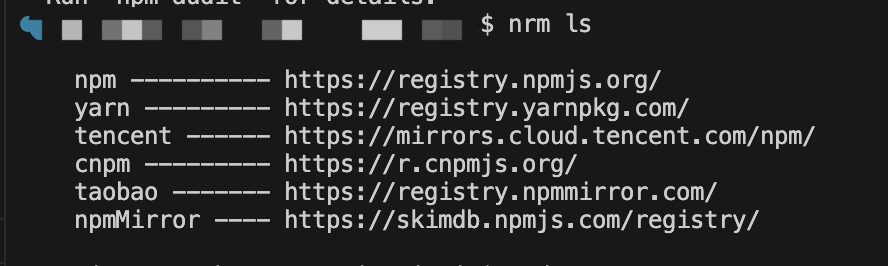

::: tip
* fastbee-view低代码可视化平台，图表或页面元素封装为基础组件，无需编写代码即可完成业务需求，项目已经获得GoView的商用授权。
* 技术栈为：Vue3 + TypeScript4 + Vite2 + NaiveUI + ECharts5 + Axios + Pinia2 + PlopJS
* 使用流程：新建项目-->可以点击上方编辑名称-->尽情发挥拖拉拽编辑页面-->保存(60s自动保存/手动保存)-->预览-->发布（生成地址）
:::

## 一、项目运行和部署
#### 1.修改根目录的 `.env.development` 文件，配置后端接口地址
```
# 后端接口地址
VITE_DEV_PATH = 'http://localhost:8080'
```

#### 2.修改完成后，开始安装依赖，建议使用 pnpm，比较快

```shell
# 安装 pnpm 
npm install -g pnpm
```

```shell
# 安装项目依赖

# pnpm（建议使用nrm切换到淘宝源 https://registry.npmmirror.com/）
pnpm install

# npm
npm install

# yarn
yarn install
```

#### 3.启动项目
```shell
#pnpm
pnpm dev

# npm
npm run dev

#yarn
yarn dev

#Makefile
make dev
```

#### 4.编译
```shell
#pnpm
pnpm run build

# npm
npm run build

#yarn
yarn run build

#Makefile
make dist
```

#### 5.部署：
Nginx配置文件中添加location ，切记不要用重复的匹配关键词，编译的文件上传到 `/var/data/nginx/smartView/` 目录下
```shell
  location ^~/view/ {
    alias /var/data/nginx/view/;
    index  index.html;
    try_files $uri $uri/ /index.html last;
  }
```

部署完访问地址： https://[域名]/view/ ，也可以通过在系统中添加外链菜单
```
# 参考外链地址：
https://iot.fastbee.cn/smartView/#/project/items
```

## 二、接口说明
```ts
项目列表 GET  /goview/project/list
新增项目 POST  /goview/project
保存项目内容 POST /goview/project/save/data
修改项目基础信息/修改发布状态  PUT  /goview/project/
删除项目 DELETE /goview/project/{ids} 
上传文件接口  /goview/project/upload
获取项目 GET /goview/project/getData 此接口涉及到预览，所以前后端白名单放行
```

## 三、菜单添加
::: tip
FastBee商业版本，有系统内置大屏和可视化平台，通过添加菜单方式访问
:::

### 1.固定大屏展示菜单
```
系统管理 -> 菜单管理 -> 新增

上级菜单：数据可视化
菜单类型：菜单
菜单图标：monitor
菜单名称：大屏展示
是否外链：是
显示排序：1
路由地址：https://iot.fastbee.cn/bigScreen   # iot.fastbee.cn 改为自己服务器的地址
是否缓存：缓存
显示状态：显示
菜单状态：正常

```

### 2.可视化平台菜单
```
系统管理 -> 菜单管理 -> 新增

上级菜单：数据可视化
菜单类型：菜单
菜单图标：monitor
菜单名称：大屏展示
是否外链：是
显示排序：2
路由地址：https://iot.fastbee.cn/view   # iot.fastbee.cn 改为自己服务器的地址
是否缓存：缓存
显示状态：显示
菜单状态：正常

```

## 四、注意事项
### 1.保证nodejs版本在v16.14.x以上，推荐使用v16.14.2。

### 2.如果使用npm install安装依赖仍然无法跑起来的话，请使用pnpm，推荐使用pnpm。

### 3.pnpm安装

```js
1. 安装 pnpm 
npm install -g pnpm
2. 安装 nrm 
npm install -g nrm
3. 使用 nrm 添加阿里镜像
nrm add taobao  https://registry.npmmirror.com/
4. nrm 查看镜像列表
nrm ls
5. nrm 应用对应镜像
nrm use taobao
```

### 4.安装过程相关问题

* 运行nrm ls时出现错误：const open = require('open')


再下载一个open包：npm i nrm -g open@8.4.2 --save 再次执行：nrm ls 



* 如果node内存泄露 

可以用`node -e 'console.log(v8.getHeapStatistics().heap_size_limit/(1024*1024))'` 查询内存

可以设置为更高的值：```export NODE_OPTIONS="--max-old-space-size=8192"```

值可选：[2048, 4096, 8192, 16384]


