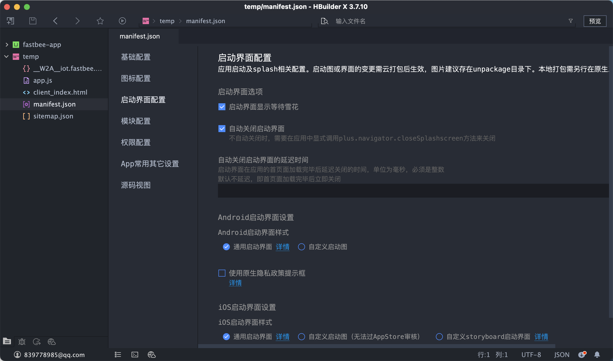

### 一、部署H5

1、用HBuilderX打包成H5页面，部署H5页面到自己的服务器。

### 二、Wap2App创建

1、在HBuilderX中选择文件-新建-项目，创建Wap2App项目，项目名自定义，wap站首页地址为H5部署地址，模板可以选择默认模板。 

2、工程创建后默认项目结构如下： 

### 三、配置应用图标及启动图

1、应用图标 应用图标是App安装到手机后，在手机桌面显示的图标；按照如下步骤配置应用图标： 双击打开manifest.json文件，点击下方“图标配置”选项卡。

 
 建议配置1024\*1024的大图标，然后自动生成并替换各种分辨率的图标。

2、启动图片 启动图片是用户从点击桌面图标到进入应用首页中间显示的欢迎图片；按照如下步骤配置应用图标。 

根据需要配置不同分辨率的启动图片，例如仅生成Android安装包，则仅配置Android启动图片即可。

### 四、应用发布

1、wap2app项目可以打包成iOS平台的ipa安装包、Android平台的apk安装包。 

2、在HBuilder中，点击顶部“发行”菜单，点击“原生App-云打包”，如下：

3、选择需要打包的平台，选择打包证书（iOS平台打包需要配置iOS证书），点击“打包”按钮即可提交云端打包，打包完成后会自动下载安装包，安装到手机即可体验。 

4、建议使用自有证书，避免打包中出现一些奇怪的问题。

