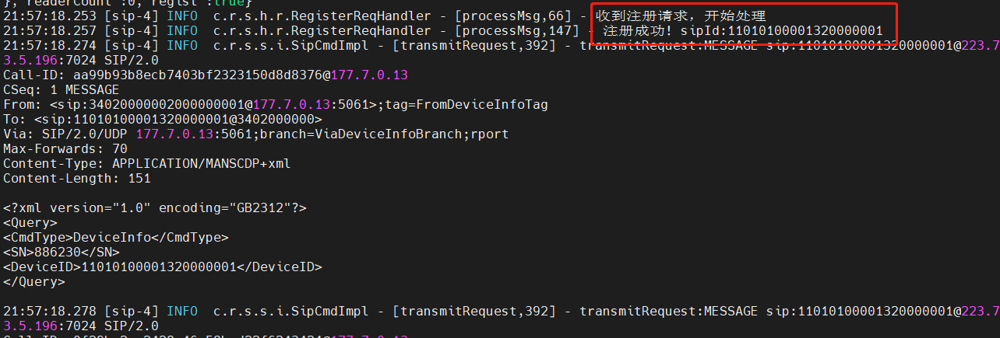
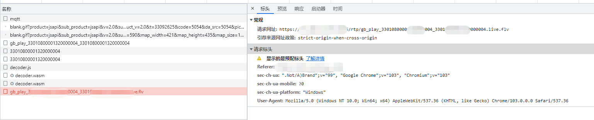

::: tip
遇到未解决的问题或者Bug，<a href="https://gitee.com/kerwincui/fastbee/issues" target="_blank" rel="nofollow">请提交 Issue</a>
:::

##### 1.设备无法注册进来
* 首先确认监控设备与平台之间的网络是连通的，如果摄像头在专用的监控内网里，和平台之间是没法通信的。
* 如果网络没问题，认真检查设备里的平台接入参数是否输入有误，任何一项输错都会导致无法注册，参数修改完毕后记得点击“保存”按钮让配置生效。
* 流量卡一般有区域限制，有些使用专用流量卡的监控设备会限制接入的目标平台，咨询设备提供商取消限制。

##### 2. 设备下没有通道
设备注册进来，但是设备下没有通道，这种情况通常发生在硬盘录像机接入的情况。
解决方法：打开监控设备的平台接入配置界面，通常在界面下方会有视频通道列表，把视频通道编号添加进去，通道编号自己编写即可，要求是20位数字并且符合国标编码规范，编号不能重复。
可以按顺序填入如下编号：34020000001320000001，34020000001320000002，...

##### 4. 视频开启很慢、卡顿中断
原因：视频码率太大，设备与平台之间的带宽太小，视频传输不上来或丢包。
解决：去设备配置界面里把视频码率降低下来，通常在设备的音视频配置菜单内；
如果设备支持主辅码流选择，选择发送辅码流会顺畅很多；
如果是通过有线或WIFI发送视频，建议视频码率调整到1500kps以下，如果是通过4G卡传输，则调整到800kbps以下；
检查你的电脑的网络情况，是否有足够带宽播放视频；

##### 5.视频设备状态不更新，显示未激活，通道ID显示未使用
排查思路：
- java的sip服务是否开启，是否成功运行，服务器udp5061端口安全组是否添加
- 查看udp端口是否监听，**window命令**: netstat -p udp -ano | find "5061"    **linux命令**: netstat -nlup | grep 5061 
- 设备信息是否填写正确，服务器域，服务器ID，认证密码是否和产品配置保持一致
- java是否有sip相关注册日志，抓包查看udp端口5061 是否有包上来
- 是否向mqtt的topic:"/产品ID/设备ID/info/post"发送消息，emqx中emqx_auth_http认证插件是否开启

> 注意！！！先用docker-compose起环境，按默认配置走一遍注册流程，熟悉流程后，再按照需求修改配置。

##### 6.视频设备直播无画面
排查思路：
- 流媒体服务器ip是否填写部署服务器公网ip，并修改服务器域名

- 服务器rtp 30000-30500:30000-30500/udp端口 安全组是否添加
- 查看zlmedia/data/www/rtp文件夹下面是否有推流文件

- 提示：“window.Jessibuca is not a constructor”，ctrl+f5 强制刷新下页面 
- 查看播放器js文件是否正常加载

- 播放地址为https，需要修改播放协议，并在流媒体服务替换证书，参考文档 [ZLMedia流媒体服务器开启https相关功能](https://github.com/ZLMediaKit/ZLMediaKit/wiki/%E6%80%8E%E4%B9%88%E5%BC%80%E5%90%AFhttps%E7%9B%B8%E5%85%B3%E5%8A%9F%E8%83%BD)

- zlmedia/conf/config.ini 中hook配置是否填写正确，调java hookapi

- 内网调试需保证相关网络连通性：

1.设备——>zlm流媒体服务器（30000-30500:30000-30500/udp rtp udp推流端口）

2.设备——>java （5061:5061/udp sip udp端口号）

3.zlm流媒体——>java（java hook api 8080端口）

4.java——>zlm流媒体服务器（http api 8082端口）

5.前端播放器——>zlm流媒体服务器（http 8082端口 https 8443端口）

- 使用官方docker容器，`zlmediakit/zlmediakit:master`

> 注意！！docker容器已更新请替换最新容器

确认播放地址格式，确认https//域名:8443和http//服务器ip:8082 浏览器是否能打开

https//域名:8443/rtp/{流ID}.live.flv

http//服务器ip:8082/rtp/{流ID}.live.flv
