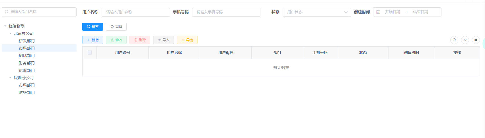
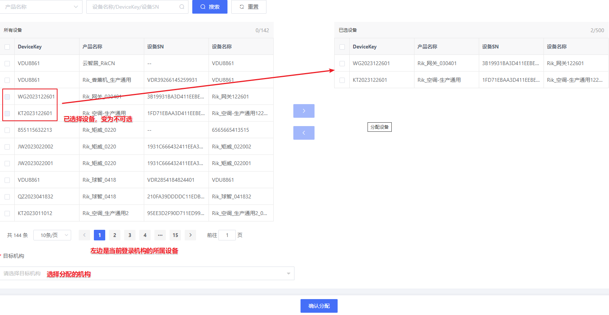
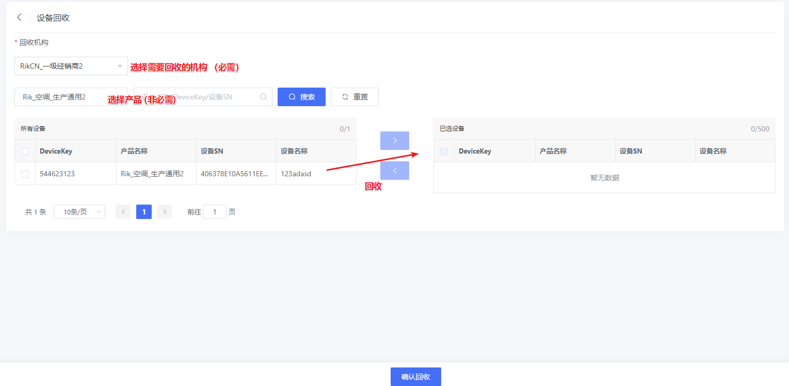

## **1、部门更改为机构**

页面参考设计如下：


1. 机构类型可以暂时新建一个字典获取，（厂商，生产厂商，经销商，服务商）层级从上到下。类型可选情况如下：

     假设当前选择的机构为 A

   - A是厂商 ，下级可选生产厂商，经销商，服务商
   - A是生产厂商 / 经销商，下级可选是 经销商，服务商
   - A是服务商 ，下级可选是服务商

2.  机构名称不能为空，而且不能重复！

3. 机构编辑，不可编辑项如下：

   

3.  每个机构都分配一个系统账号，部门表更改为机构表如下

   ```sql
   CREATE TABLE `sys_dept` (
     `dept_id` bigint(20) NOT NULL AUTO_INCREMENT COMMENT '机构id',
     `dept_user_id` bigint(20) NOT NULL COMMENT '机构系统账号ID',
     `parent_id` bigint(20) NOT NULL DEFAULT '0' COMMENT '上级机构id',
     `ancestors` varchar(50) NOT NULL DEFAULT '' COMMENT '祖级列表',
     `dept_name` varchar(30) DEFAULT '' COMMENT '机构名称',
     `order_num` int(4) DEFAULT '0' COMMENT '显示顺序',
     `leader` varchar(20) NOT NULL COMMENT '联系人',
     `phone` varchar(11) DEFAULT NULL COMMENT '联系电话',
     `status` char(1) DEFAULT '0' COMMENT '机构状态（0正常 1停用）',
     `del_flag` char(1) DEFAULT '0' COMMENT '删除标志（0代表存在 2代表删除）',
     `create_by` varchar(64) DEFAULT '' COMMENT '创建者',
     `create_time` datetime DEFAULT NULL COMMENT '创建时间',
     `update_by` varchar(64) DEFAULT '' COMMENT '更新者',
     `update_time` datetime DEFAULT NULL COMMENT '更新时间',
     PRIMARY KEY (`dept_id`) USING BTREE
   ) ENGINE=InnoDB AUTO_INCREMENT=110 DEFAULT CHARSET=utf8mb4 ROW_FORMAT=DYNAMIC COMMENT='机构表';
   ```

   新增机构系统账号ID，与用户表user_id 一对一关联。

   新建机构时，生成**一个系统账号**，为机构生成一个**管理员的角色**

   如下图所示：新建一个名为 ‘**ABCD_2136**’ 机构

   

   生成的机构关联账号：

   

   生成的机构关联角色

   

​       角色的权限默认是全选，

## 2、角色

​       原来的系统角色体系只有一套，不同部门或者不同组织灵活配合欠缺，如下：


页面参考更改如下：


   1. 角色与机构绑定，一个机构有一套角色配置

   2. 角色类型，由原来的可选，改为现在的自由填写，WEB端菜单权限，小程序菜单权限，可自定义勾选。

   3. 旧版本 ‘’权限字段‘’，暂时保留 

      

   4. 新版本，编辑是，不可更改内容如下：

      

      5. **机构的菜单权限受到机构自动生成的管理员角色限制。**但是机构的下级机构不受当前机构影响。

         即是：每个机构的权限都是单独控制，由最上级管理员角色控制菜单权限

         示例：当前机构 **ABCD_2136**’ 

         

         如果 WEB权限选中如下:

         

         那么在当前机构新建角色，WEB菜单只有 ‘**管理员**’ 选中的菜单权限

         


## 3、用户管理

用户管理保留现在的树结构展示




1. 将部门全部改为机构。

2. 新增用户页面，

   - 删除 ：用户性别、岗位

   - 手机号为必选

   - 角色是当前机构的角色选项

   - 归属部门 ，改为  归属机构。并当左边选中机构，进行新增时，新增用户弹窗应该显示选中的机构 （目前没有）。效果应该如下图

     


新增弹窗可以按照下图设计：


3.  用户编辑

   如果**账号是机构的绑定用户**，则用户角色不能更改

4. 用户列表，更多 -> 分配角色 。可以去掉，或者查询角色要按照当前机构角色


5. 添加是否显示下级按钮，勾选时，查询用户列表数据应该为当前机构以及其所有下级机构的用户列表


#### 4、设备管理

更改为机构管理用户后，机构与设备管理维护也需要变更。

按照机构树结构分层级管理用户，用户与设备是1对多关系。设备分配/设备回收等维护设备与机构关系


需要实现功能：

##### **4.1、添加设备 - 批量导入**

​     示例图： 产品为必选项


**导入Execl表字段**：

  		必要字段： device_name  、serial_number
  	
  		导入选择： product_id、product_name
  	
  		默认字段： user_id 、user_name  （默认当前机构绑定的用户）、   firmware_version（默认1.0）、status( 1-未激活)

​		 需要清除字段（tenant_id、tenant_name）

##### 4.2、分配设备**

即是上级机构的设备，分配给它的下级机构。

###### **4.2.1、 选择分配**

按照设备选择分配设备，示例图如下：



###### **4.2.2 、导入分配**

以Execl文件导入设备的同时，分配给下级机构，（相当于设备批量导入，但可选择下级机构导入）


##### **4.3、回收设备**

将下级机构的设备，回收到当前机构



##### 4.4、设备导入记录    （后续版本再做）**

  

增加一张表记录设备批量导入的情况。

##### **4.5、设备回收记录 （后续版本做）**

##### 4.6、**设备分配记录  （后续版本做）**

##### 4.7、设备查询


#### 5.产品管理 

目前产品是根据租户id  tenant_id 来区分不用租户的产品。

这里将租户id ，租户名称 （tenant_id 、tenant_name） 改为 （user_id 、user_name）

只有管理员以上角色才可以新增产品、即是每个机构都可以单独创建自己的产品，进行管理（每个机构都绑定一个管理员角色的用户）。

即是： 机构管理产品

需要更改点：

1. 查询产品列表

    ProductServiceImpl#selectProductList 

    ProductServiceImpl#selectProductShortList

   ProductServiceImpl#insertProduct

   
