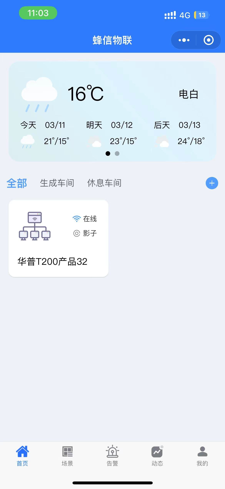

## 1.设备简介


- 支持 **MQTT 协议，TCP协议**；每路连接分别支持一路 socket 备份；支持注册包，心跳包数据；
- 支持**MODBUS转JSON**，支持变量个数128
- 多种参数设置方式：网络、串口 AT 指令和电脑端设置软件配置；
- 支持 **RS232 和 RS485** 两种接口，使用更方便；
- 支持 12~36V 宽电压供电；多种指示灯，状态判断方便准确；
- 工业级设计，软、硬件看门狗，超高可靠性。


## 2.设备接入

**硬件准备：**

- HP-ERS-T200V2 设备一台 （网口版本：含网线）

- DC12V 1A 电源适配器  三个 （接真实子设备需要两个）

- 串口（或 USB）转 RS485 接头一个

- 电脑一台

- RS485 AB线若干 （测试时普通电线即可）

  如果需要测试真实设备上报，则需要增加Modbus子设备
  
  温湿度变送器 、空气质量变送器  等等
  
  

**软件准备：**

- [设备配置工具： HP-Ethernet-Tool V0.0.10.exe （不改IP可没有）](/doc//tool/hp.zip)

- [Modbus Slave 仿真模拟器](/doc//tool/modbus.rar)

- [串口通讯助手](/doc//tool/uart.rar)

  

设备接入示意图如下：


##### 2.1、设备配网 

设备机身默认IP地址为：192.168.1.200 (设备机身侧可见)

把设备接入到PC电脑所在的网络中(需要和电脑在同一个网络)。

###### 2.1.1、如果需要更改设备的IP地址，则使用配置工具  **HP-Ethernet-Tool V0.0.10.exe** 

 **若使用默认IP（192.168.1.200），2.1.1配置可忽略** 

   在确保设备接入与PC电脑端同一个网络的情况下，打开工具，进行搜索，如下图所示


搜索设备后，对设备IP进行更改设置如下：设备IP可以设置为  192.168.x.xxx,其他默认

其中MAC为设备机身侧的MAC号码。


至此，设备的IP地址已经修改完成。

## 3、使用 **Modbus slave** 软件模拟子设备接入该DTU设备

#### 3.1、硬件接线以及仿真软件配置 

硬件侧环境配置如下：


USB转485接口工具插入电脑后，查看端口占用情况，我的电脑情况如下：


上面USB转485工具使用的端口是COM5， Modbus Slave 仿真模拟器  模拟Modbus子设备，配置如下：

PS：**此处设置的串口参数，必须和网关设备RS485的串口参数一致**。


然后设置寄存器，以及寄存器的值。演示案例设置了0-4 、5个寄存器，值分别设置为 10-50，如下图所示：


我们为了演示多个子设备的情况，因此按照上面的再增加一个子设备的配置，如下


最终配置如下：


#### 3.2、平台配置

##### 3.2.1、采集点配置

设置好子设备模仿真拟器后，配置一下云平台。先创建一个采集点模块

- 选择边缘网关方式

- 从机地址必须与 子设备模仿真拟器配置的一致 

  

添加子设备，从机地址与 子设备模仿真拟器配置 Slave ID的一致 为 1


添加子设备的物模型，模型标识与寄存器地址关联


最终配置如下：这里配置了两个从机，**从机地址**分别是 **1 2**

子设备01物模型 k1-k5  ； 子设备02物模型k21-k25


##### 3.2.1、创建产品

创建好采集点模板好，我们需要根据这个采集点模板创建产品


##### 3.2.3、创建设备


#### 3.3、设备侧配置

##### 3.3.1、浏览器配置设备

如果设备IP没有更改，在浏览器输入 **192.168.1.200**，如果更改了，则输入更改后的IP地址，示例图如下：

PS：**这里的RS485配置参数，要跟子设备仿真软件配置的一致**


##### 3.3.2、配置设备MQTT连接信息

平台侧查看设备基础信息- 认证信息


内容如下：分别是 clientId、username、password、port

```json
{
  clientId:S&D13QN3R79D12&2244&1,
  username:FastBee,
  passwd:PW05288MY41YX878,
  port:1883
}
```

###### **3.3.2.1、配置设备的连接信息**

PS：**这里的clientId中 & 需要替换为 $$     S&D13QN3R79D12&2244&1     ---->     S$$D13QN3R79D12$$2244$$1**


###### 3.3.2.2、配置MQTT的发布/订阅主题

主题如果要自己定义，可以根据平台规则引擎转换。

发布主题：设备  --> 云平台 

```
主题组成如下 /{productId}/{clientId}/property/post
示例值：    /2244/D13QN3R79D12/property/post
```

订阅主题：云平台 ---> 设备

```
主题组成如下 /{productId}/{clientId}/function/get
示例值：    /2244/D13QN3R79D12/function/get
```


###### 3.3.2.3、定时轮询配置

- 定时轮询模式，选择蜂信Modbus转JSON
- 定时时间，单位是秒，每个属性上报的采集时间间隔，按需设置
- 设置数据点，一共支持200个
- 使能，先勾选使能，才可以配置
- 关键字 与寄存器地址：如**k1 与寄存器地址0是绑定关系** 、 与云平台配置采集点模板中 **子设备01**中的**物模型k1**需要一致
- 从站地址：需要与云平台**采集点模板的从机地址**一致   
- 寄存器地址：子设备的数据点
- 功能码： 如03功能码：读保持寄存器 ，还有 01 、02 、 04、10 等
- 数据格式： Modbus中的数据格式 ，按照子设备的规定来选用即可，一般默认为 16位有符号


配置从机2的 5个采集点，如下：


操作完成后，需要重启设备让配置生效：


我们可以看看仿真软件，是否有日志：如果有说明配置成功


#### 3.4、设备实时采集情况

可以看到设备已经在线


再看看两个子设备的上报情况：

仿真设备设置的值：


上报平台实时数据如下：


我们更改一下，仿真设备的子设备值，看看平台实时数据变化情况：

说明设备采集已经实时上报


#### 3.5、设备下发指令

先更改一个属性是可读写状态


再查看运行状态，服务下发，可以看到改属性可以下发指令了


下发指令


查看仿真设备是否改变值，可以看到仿真子设备已经改变了值


实时查看指令下发日志，可以看到，每个更改都已经成功：


## 4.小程序接入

#### 4.1、接入方式

移动端包含小程序、Android、IOS 和 H5 等，本次案例选择小程序端操作。

1、在微信小程序中搜索并添加“蜂信物联”小程序。


2、点击小程序右上角“+“”号，添加设备

小程序提供了三种添加方式，分别是“配网添加”、“扫描添加” 和 “关联添加”，此处选择“扫描添加”

添加先准备好二维码，二维码可以在平台直接获取


二维码


3、添加设备，选择“扫描添加”，对准二维码进行扫描


4、我们可以看到设备已添加成功


