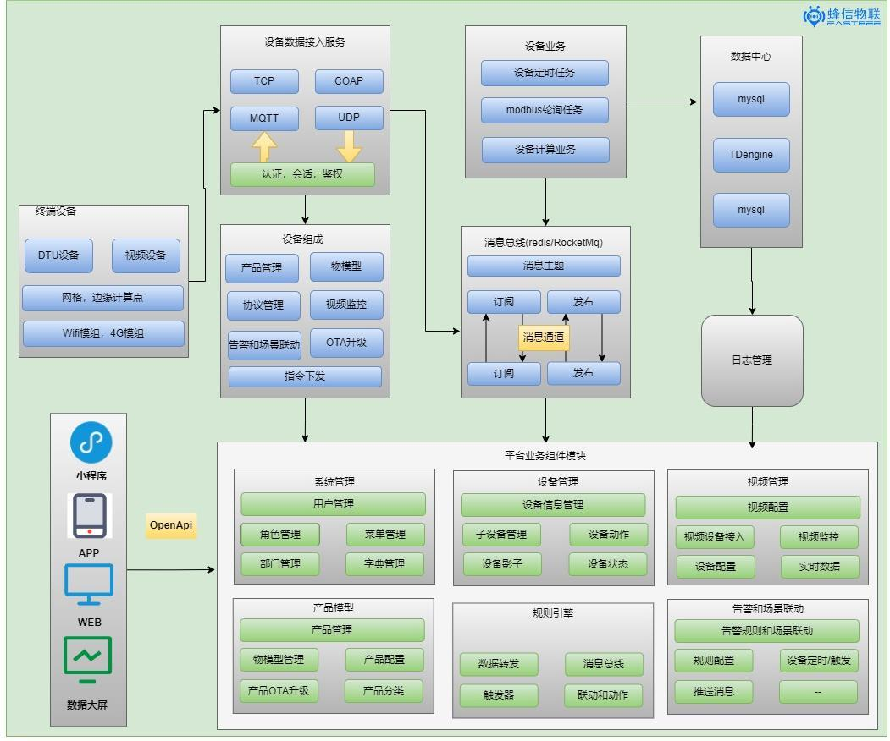

 

## 系统架构
<iframe id="embed_dom" name="embed_dom" frameborder="0" style="display:block;width:100%;height:700px;" src="https://www.processon.com/embed/643ff6fda3670916411168ab"></iframe>

## 系统模块

  

## 🚀 Version2.2
* 增加规则引擎，重构设备告警和场景联动
* 场景联动增加产品触发和指定设备触发、多种触发条件、静默时间和延迟执行，支持物模型的对象和对象数组类型
* 增加规则脚本，支持消息重发，兼容更多设备接入
* 消息通知支持邮箱、腾讯短信和语音、阿里短信和语音、微信、企业微信、钉钉等告警通知方式
* 增加短信登陆
* 产品增加定位方式，创建设备默认继承定位方式，设备可单独修改
* Bug修复和代码优化
* 提示：升级后旧版本告警和场景联动配置不再生效，升级前备份好数据

 

## 🚀 Version2.1
* Mqtt主题重构，物模型主题统一为接口调用
* OTA升级优化
* Emqx升级到5.1版本
* 支持微信登录
* 增加视频中心模块，包括视频监控分屏显示，录像管理，通道管理和配置管理
* 设备详情优化为懒加载
* 设备分享支持分享设备指定功能属性
* modbus协议兼容01、02、04读功能码，05写功能码
* modbus解析数据类型兼容：位、16位无符号、16位有符号、32位有(无)符号(ABCD/CDAB)、32位浮点数(ABCD/CDAB)
* 边缘网关方案兼容
* 修复场景联动/告警触发指令兼容
* 修复影子模式，topic整合
* 设备回复闭环，展示设备下发指令影响详情
* 优化设备上报数据计算、处理、存储
* 平台界面优化改进和bug修复
* 移动端：新增天气预报，微信登陆，优化首页UI布局，完善用户管理

 

## 🚀 Version2.0
::: details
* 新增 **协议管理**，系统内部支持**json**, **modbus**，和**注解方式**自定义通讯协议解析 。
* 基于Netty的**MqttBroker**，支持**集群**, 基于Netty搭建的**TCP**服务端 , **UDP**服务端 , 所有协议的设备可以统一管理。
* 新增 **网关模块** ,支持设备 **数据转发**，**协议解码编码**，**数据计算**，**规则引擎**
* **Emq**处理消息模块重构，Emq在原基础上支持**modbus协议**和**各种硬件自定义通讯协议**。支持**数据转发，数据解耦。**
* **OTA**前后端升级重构，对标企业级的OTA升级流程
* 支持两种mqttBroker，emq和基于netty的MqttBroker，可以自由切换。
* 支持modbus云端轮询
* 支持modbus设备模拟
* 前端配套后端业务页面更新。

#### 1.平台总览

#### 2.平台架构

#### 3.模块调整

:::

 

## 🚀 Version1.3.1
::: details
 * 物模型新增对象类型和对象数组类型，用于支持子设备和物模型分组
 * 物模型的数组类型改为：integer（替换int）、decimal（替换double）、string、object
 * 物模型删除is_top(置顶)，增加is_readonly(只读)和order(排序)
 * 告警/定时/场景联动暂不支持对象类型、对象数组类型和数组
 * 设备列表页面简化，删除物模型，提高页面加载速度
 * 视频监控整合到产品和设备里面
 * 增加视频配置菜单，动态配置流媒体服务器和批量生成设备通道
 * 视频监控支持直播、云台控制、录像回放
 * 视频监控使用开源的播放器，已购买商用播放器，2.0版本发布使用
 * 移动端对应功能支持
:::

 

#### 🚀 项目在不断完善中，有其他需求或者好的建议可以反馈一下 <a href="https://gitee.com/kerwincui/fastbee/issues" target="_blank">提交ISSUE</a>